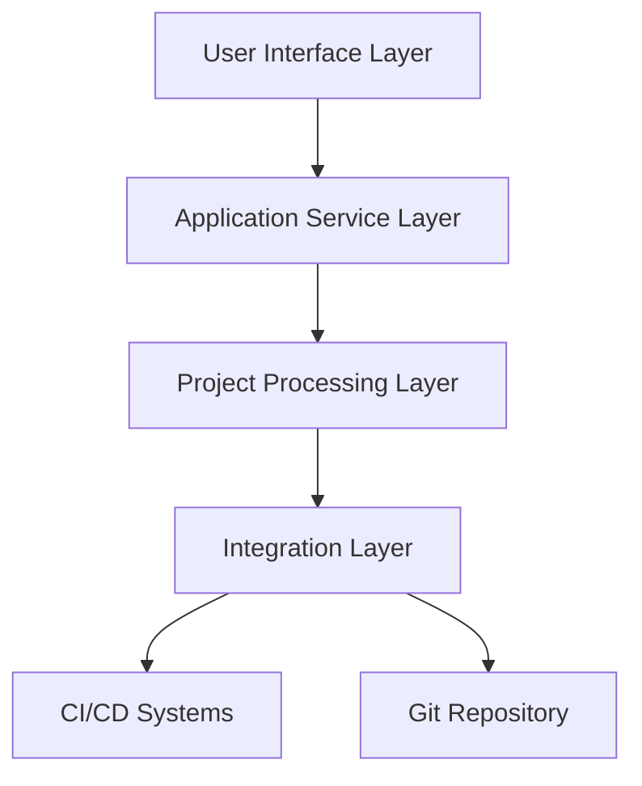
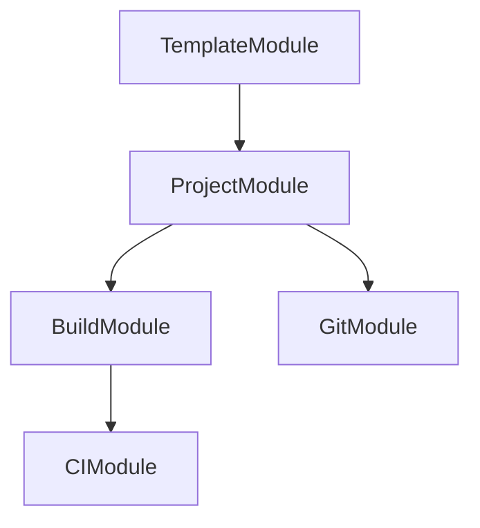
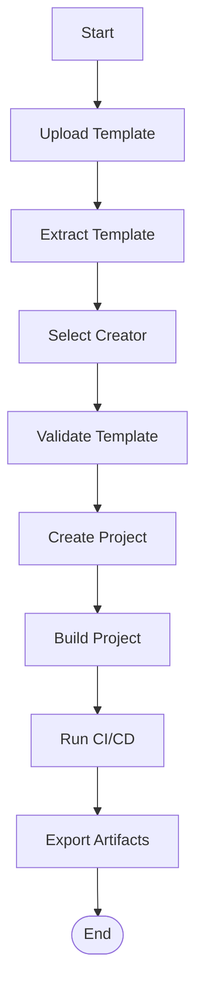
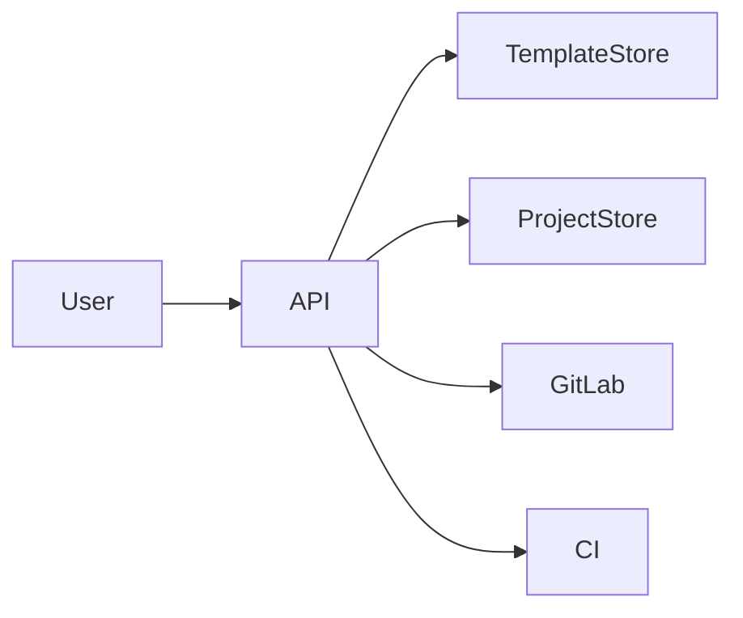
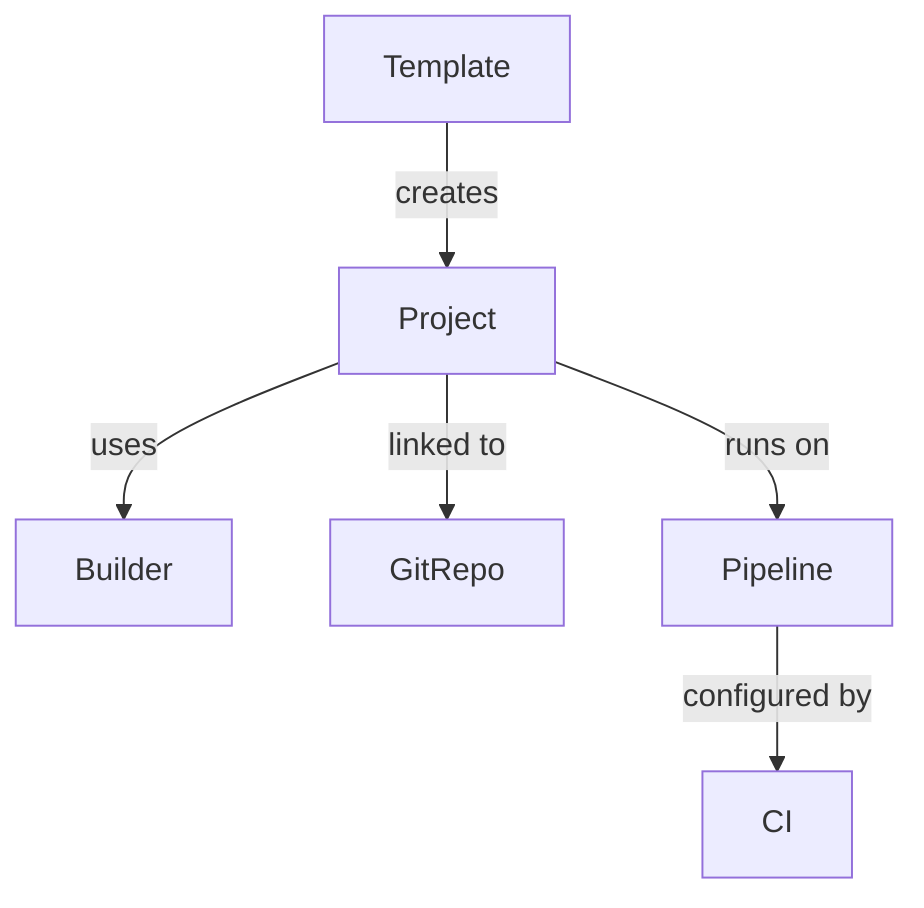

# Архитектура Template Framework

## TOGAF Layered View

```mermaid
graph TB
  A[User Interface Layer] --> B[Application Service Layer]
  B --> C[Project Processing Layer]
  C --> D[Integration Layer]
  D --> E[CI/CD Systems]
  D --> F[Git Repository]
```

## ODA Modular View

```mermaid
graph TD
  TemplateModule --> ProjectModule
  ProjectModule --> BuildModule
  BuildModule --> CIModule
  ProjectModule --> GitModule
```

## BPMN User Flow

```mermaid
flowchart TD
  Start --> Upload[Upload Template]
  Upload --> Extract[Extract Template]
  Extract --> Select[Select Creator]
  Select --> Validate[Validate Template]
  Validate --> Create[Create Project]
  Create --> Build[Build Project]
  Build --> CI[Run CI/CD]
  CI --> Export[Export Artifacts]
  Export --> End([End])
```

## DFD (Data Flow Diagram)

```mermaid
graph LR
  User --> API
  API --> TemplateStore
  API --> ProjectStore
  API --> GitLab
  API --> CI
```

## Метамодель (Knowledge Graph)

```mermaid
graph TD
  Template -->|creates| Project
  Project -->|uses| Builder
  Project -->|linked to| GitRepo
  Project -->|runs on| Pipeline
  Pipeline -->|configured by| CI
```
