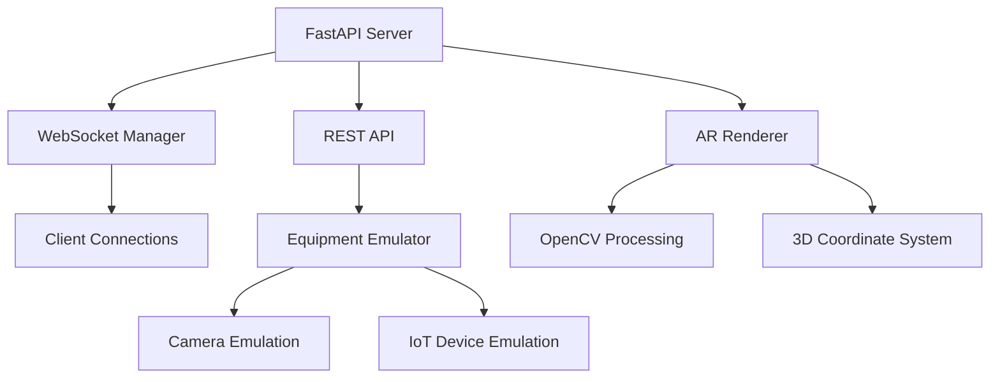

# JustTests

```mermaid
graph TD
    A[FastAPI Server] --> B[WebSocket Manager]
    A --> C[REST API]
    B --> D[Client Connections]
    C --> E[Equipment Emulator]
    E --> F[Camera Emulation]
    E --> G[IoT Device Emulation]
    A --> H[AR Renderer]
    H --> I[OpenCV Processing]
    H --> J[3D Coordinate System]
```
