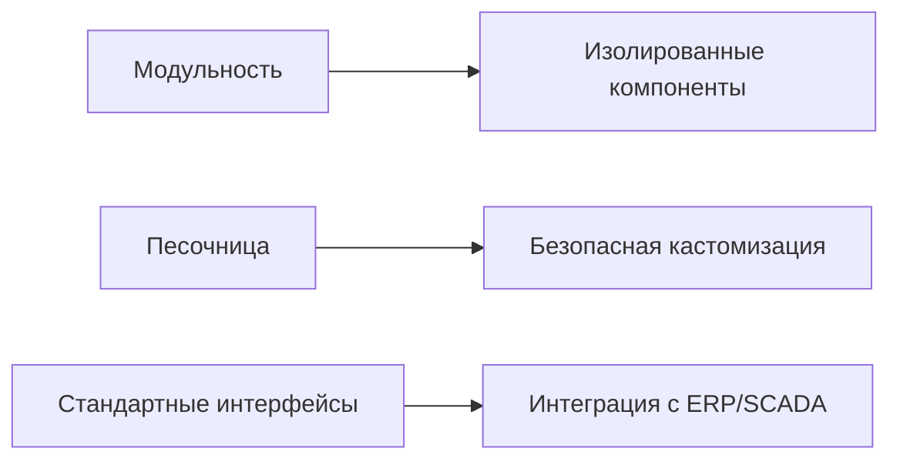
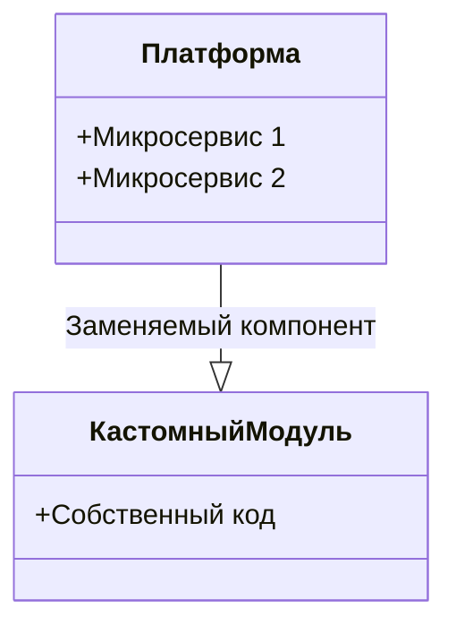
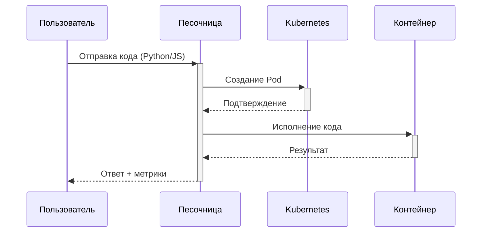
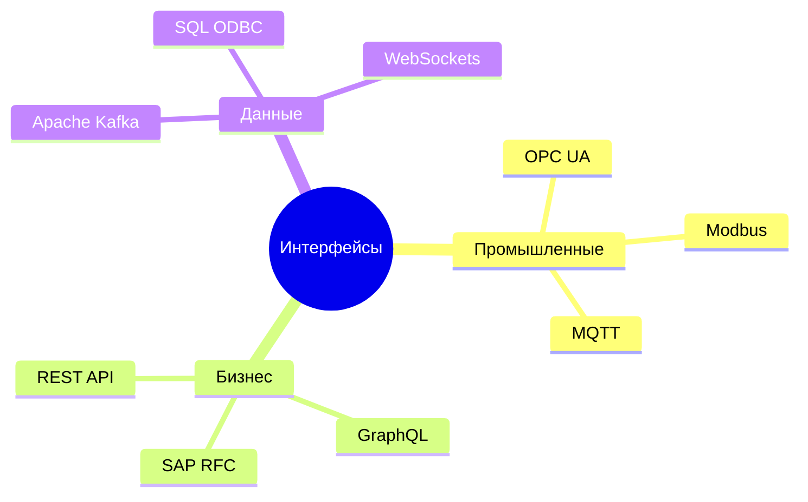
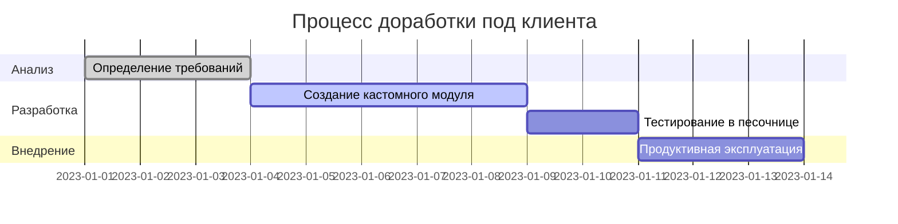

# Детальный разбор архитектурной гибкости AIoT-платформы

## Архитектурная диаграмма (Пункт 8)


## 1. Модульность → Изолированные компоненты

### Техническая реализация


**Ключевые характеристики:**
- Каждый функциональный блок работает как самостоятельный Docker-контейнер
- Общение через API Gateway с обязательной версионизацией
- Изоляция на уровне:
  - Сети (Calico network policies)
  - Памяти (cgroups)
  - Хранилища (ReadOnlyRootFilesystem)

**Пример замены компонента:**
```python
# Псевдокод замены драйвера OPC UA
platform.replace_driver(
    old_driver=OPCDriverV1,
    new_driver=CustomOPCDriver,
    config={"endpoint": "opc.tcp://10.0.0.1:4840"},
    rollback_timeout=300  # секунд
)
```

## 2. Песочница → Безопасная кастомизация

### Схема работы


**Ограничения среды:**
| Ресурс          | Лимит              | Технология контроля |
|-----------------|--------------------|---------------------|
| CPU             | 0.5 ядра           | Kubernetes quotas   |
| Память          | 512 MB             | cgroups v2          |
| Время выполнения| 30 сек             | Timeout middleware  |
| Дисковое пространство| 100 MB       | tmpfs mount         |

## 3. Стандартные интерфейсы → Интеграция

### Поддерживаемые протоколы


**Пример конфигурации OPC UA:**
```yaml
# config/opcua.yaml
endpoints:
  - name: production-line-1
    url: "opc.tcp://plc1.prod:4840"
    security: Basic256Sha256
    tags:
      - temperature
      - vibration
    sampling_interval: 1000  # ms
```

## 4. Полный цикл кастомизации



**Преимущества подхода:**
1. Гарантированная совместимость через:
   - Стандартизированные API-контракты
   - Semantic versioning для всех компонентов
2. Безопасность:
   - Изоляция исполнения пользовательского кода
   - Audit log всех изменений
3. Экономия времени:
   - Готовые адаптеры для 95% промышленного оборудования
   - Автоматические миграции при обновлениях

## 5. Рекомендации по работе с платформой

### Для разработчиков:
```bash
# Шаблон создания нового модуля
platform new-module \
  --name=custom-analytics \
  --template=python3 \
  --requirements=pandas,numpy \
  --sandbox-timeout=20s
```

### Для архитекторов:
1. При замене компонентов:
   - Проверять совместимость через `platform check-compatibility`
   - Использовать canary-развертывание
2. При интеграции:
   - Начинать с тестового контура
   - Мониторить метрики через Prometheus/Grafana

### Пример метрик для мониторинга:
```prometheus
# HELP sandbox_executions_total Total sandbox executions
# TYPE sandbox_executions_total counter
sandbox_executions_total{status="success"} 42
sandbox_executions_total{status="failed"} 3

# HELP module_cpu_usage CPU usage per module
# TYPE module_cpu_usage gauge
module_cpu_usage{module="custom-analytics"} 0.7
```
