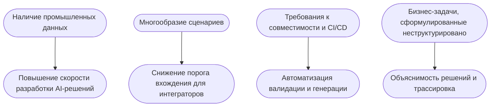

# Платформа AIoT как конструктор решений

##  1.

## 2. Модель мотивации (ArchiMate)

## 🏛 Слои TOGAF и сущности

| Слой TOGAF             | Отображаемые сущности / компоненты                             |
|------------------------|----------------------------------------------------------------|
| Business Architecture  | `type`, `object`, `item`, `template`, `project`, `pipeline`    |
| Data Architecture      | `script`, `environment`, `resource`, `storage`, `test_plan`    |
| Application Architecture | `template_engine`, `builder`, `CI`, `VCS`, `API`, `генераторы` |
| Technology Architecture| `docker`, `systemd`, `python venv`, `kvm (qemu)`, `git (GitLab)` |
| Cross-cutting (Shared) | `bus` (`RabbitMQ`, `Kafka`), `knowledge_base` (`SQL`, `FS`, `S3`)    |

---

## ⚙️ Компоненты инфраструктуры

| Компонент           | Описание                                                                 |
|---------------------|--------------------------------------------------------------------------|
| **API-шлюз**         | Точка входа во все REST и WebSocket вызовы, маршрутизирует запросы.    |
| **Frontend** | Angular, JS, Flask-приложения, CLI, Web UI, работают через API-шлюз.   |
| **Middle backend**   | FastAPI, обработка быстрых операций, управление логикой и метаданными.  |
| **Deep backend**    | Долгие и отложенные задачи: сборка, тестирование, CI/CD, интеграции.    |
| **Bus**             | Шина событий (RabbitMQ, Kafka). Служит связующим звеном между модулями. |
| **Template Engine** | Генератор сущностей (проекты, пайплайны и т.д.) по кастомизируемым шаблонам. |
| **Knowledge Base**  | Хранилище экспертных данных. Поддержка:  `in-memory`, `dump/restore` на FS/S3, `PostgreSQL + timescale` / `SQLite` (через SQLAlchemy), гибридные конфигурации |

---

## 🧠 Механизмы взаимодействия (Frontend ↔ Backend)

| Механизм     | Назначение                                |
|--------------|--------------------------------------------|
| `REST`       | Основной способ взаимодействия через API   |
| `WebSocket`  | Режим подписки на события, realtime        |
| `WebHook`    | Для внешних уведомлений и интеграций (CI)  |

---

## 🔐 Авторизация (в разработке)

| Возможности                        | Поддержка                                                   |
|-----------------------------------|--------------------------------------------------------------|
| Роли пользователей                 | `user`, `developer`, `admin`                                |
| IAM-интеграция                     | Подключение к `Keycloak` и другим провайдерам                |
| Методы авторизации                 | `Basic Auth`, `Bearer JWT`, `client_id` / `secret_key`      |
| Контроль доступа                   | Управление правами на уровне маршрутов и сущностей           |

---

## 🗄 Пространства хранения (Storage Spaces)

| Путь                  | Назначение                                                                 |
|-----------------------|----------------------------------------------------------------------------|
| Тип FS:               |                                                                            |
| `/uploads`            | Входящие пользовательские данные. Запрещено исполнять. Очищается по сроку. |
| `/downloads`          | Временное хранилище результатов для скачивания.                            |
| `/workspace/{uuid}`   | Runtime-папка. Работает в пределах тарифного времени.                      |
| `/storage/{uuid}`     | Долговременное платное хранилище (локальное или через S3).                 |

---

## 📦 Интеграции и расширения

| Категория     | Технологии и подходы                                                      |
|---------------|---------------------------------------------------------------------------|
| CI/CD         | `GitLab CI`, `Jenkins`. Runner — по выбору пользователя                   |
| VCS           | `GitLab` API по умолчанию. Поддержка `GitHub`, `Gitea` и других           |
| Deployment    | REST-интеграции с облаками, edge, внешними средами                        |
| Установка     | `pip install platformfw` + `deb`-пакет при необходимости                  |
| Оркестрация   | `docker-compose`, `systemd`, `dstack`, `slurm`, альтернативы — по лицензии|

---

## 🧭 Предложение по архитектурным диаграммам

| Название диаграммы        | Нотация     | Описание                                             | TOGAF Layer              |
|---------------------------|-------------|------------------------------------------------------|--------------------------|
| business_process_flow     | BPMN        | Поток бизнес-процесса от запроса до доставки         | Business Architecture    |
| motivation_model          | ArchiMate   | Цели, стейкхолдеры, бизнес-сервисы                   | Business Architecture    |
| data_entity_model         | ER          | Модель сущностей базы знаний                         | Data Architecture        |
| data_flow_platform        | DFD         | Потоки данных между компонентами                     | Data Architecture        |
| application_components    | ArchiMate   | Взаимодействие сервисов, API, билдеров               | Application Architecture |
| component_details         | UML         | Внутренняя структура модулей генерации               | Application Architecture |
| technology_stack          | ArchiMate   | Инфраструктура и зависимости                         | Technology Architecture  |
| deployment_view           | UML         | Распределение компонентов по узлам                   | Technology Architecture  |
| traceability_matrix       | TOGAF       | Связь целей → сущностей → данных → инфраструктуры    | All domains              |
| roadmap_phases            | ArchiMate   | План поэтапного внедрения                            | All domains              |

