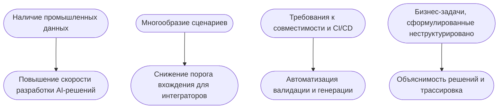

# 🏛 Архитектура платформы  AIoT как конструктора решений (TOGAF-ориентированная модель)

## Позиция платформы AIoT как информационной системы

Платформа AIoT относится к **B2B2B** системам.

- По уровню управления:
    - DSS / BI (система поддерки принятия решений, аналитика)
    - ES (экспертная система)
    - KM (управление знаниями: хранение и обработка экспертных знаний)

- По сфере применения: 
    - многосервисные отраслевые (цифровизация промышленности) специализированные решения, включающие исследования

- По архитектуре: 
    - микросервисная с предоставлением доступа к технологиям как SaaS

- По степени автоматизации:
    - AI-Enhanced System (с элементами машинного обучения)

## 📐 Архитектурные уровни по TOGAF

Платформа построена по многоуровневой архитектуре, соответствующей рекомендациям TOGAF и включающей:

---

### 1. 📈 Business Architecture — Бизнес-архитектура

Определяет **цели**, **роли пользователей**, **основные функции** и **ценностные сценарии использования платформы**.

- Цель:
  - Снижение стоимости разработки за счет переиспользования знаний о повторяемости сущносей и процессов

- Роли:
  - Интегратор
  - Разработчик

- Ценности:
  - Снижение порога вхождения в проектирование решений с AI
  - Ускорение генерации и проверки решений
  - Унификация подхода ко всем этапам: от идеи до развёртывания
- Основные функции:
  - Поиск и генерация шаблонов под задачу
  - Валидация входных данных и структуры
  - Автоматизированная сборка решений (backend, UI, edge, dataflow)
  - Интерпретация, документирование, сравнение
  - Развёртывание и доставка результатов

---

## 📚 Типы сущностей, уровни и шаблонизация

| Тип                | Назначение                                           | Уровень         | Может быть шаблоном | Пример                              |
|--------------------|------------------------------------------------------|------------------|----------------------|--------------------------------------|
| `template_query`   | Формализованный запрос для подбора шаблона           | Мета             | ❌                   | запрос на обучение модели            |
| `template`         | Шаблон генерации сущности (project/pipeline)         | Мета             | ✅                   | `ml_classifier_template`             |
| `project`          | Сгенерированный проект на основе шаблона             | Экземпляр        | ✅                   | `backend_v2_project`                 |
| `script`           | Скрипт генерации или исполнения                      | Мета             | ✅                   | `train.py`, `deploy.sh`              |
| `pipeline`         | Шаблон или реализация процесса                       | Мета + Экземпляр | ✅                   | `train_pipeline`, `mlflow_pipeline`  |
| `test_plan`        | План тестов, валидаторов, метрик                     | Мета             | ✅                   | `unit_test_plan`, `smoke_suite`      |
| `environment`      | Описание среды выполнения                            | Мета             | ✅                   | `docker`, `venv`, `slurm_cluster`    |
| `resource`         | Конкретный вычислительный ресурс                     | Экземпляр        | ❌                   | `gpu_node01`, `docker_runner`        |
| `storage`          | Пространство хранения                                | Экземпляр        | ❌                   | `workspace`, `s3://bucket/model`     |

---

## 📂 Категоризация и иерархия

| Сущность  | Назначение                             | Примеры                             |
|-----------|-----------------------------------------|--------------------------------------|
| `object`  | Категория или группа                    | `ml`, `frontend`, `tests`, `docs`    |
| `item`    | Элемент внутри object с типом           | `ml/train.py`, `docker_env.yaml`     |
| `type`    | Описание типа сущности                  | `project`, `pipeline`, `script`      |

---

## 🧪 Применимость универсальных методов

| Тип              | CRUD | select | validate | import | export | health |
|------------------|------|--------|----------|--------|--------|--------|
| `template_query` | ✅   | ✅     | ✅       | ✅     | ✅     | ❌     |
| `template`       | ✅   | ✅     | ✅       | ✅     | ✅     | ✅     |
| `project`        | ✅   | ✅     | ✅       | ✅     | ✅     | ✅     |
| `script`         | ✅   | ✅     | ✅       | ✅     | ✅     | ✅     |
| `pipeline`       | ✅   | ✅     | ✅       | ✅     | ✅     | ✅     |
| `test_plan`      | ✅   | ✅     | ✅       | ✅     | ✅     | ✅     |
| `environment`    | ✅   | ✅     | ✅       | ✅     | ✅     | ✅     |
| `resource`       | ✅   | ✅     | ✅       | ✅     | ✅     | ✅     |
| `storage`        | ✅   | ✅     | ❌       | ✅     | ✅     | ✅     |

---

## 🔗 Связи между сущностями

| Источник         | Целевой элемент        | Связь                                      |
|------------------|------------------------|---------------------------------------------|
| `template_query` | `template`             | Подбор подходящего шаблона по критериям     |
| `template`       | `project`, `pipeline`  | Генерация экземпляра по шаблону             |
| `project`        | `resource`, `env`      | Выполняется в определённой среде            |
| `pipeline`       | `script`, `test_plan`  | Использует компоненты                       |
| `test_plan`      | `project`, `pipeline`  | Проверяет корректность результата           |
| `environment`    | `resource`             | Разворачивается на ресурсе                  |
| `storage`        | `project`, `artifact`  | Место хранения результата                   |
| `item`           | `object`               | Элемент категории                           |

## 2. Модель мотивации для ПЛАТФОРМЫ AIoT (ArchiMate)

```mermaid
graph TD
    goal1([Повышение скорости разработки AI-решений])
    goal2([Снижение порога вхождения для интеграторов])
    goal3([Автоматизация валидации и генерации])
    goal4([Объяснимость решений и трассировка])

    driver1([Наличие промышленных данных]) --> goal1
    driver2([Многообразие сценариев]) --> goal2
    driver3([Требования к совместимости и CI/CD]) --> goal3
    driver4([Бизнес-задачи, сформулированные неструктурировано]) --> goal4
```

## 🏛 Слои TOGAF и сущности

| Слой TOGAF             | Отображаемые сущности / компоненты                             |
|------------------------|----------------------------------------------------------------|
| Business Architecture  | `type`, `object`, `item`, `template`, `project`, `pipeline`    |
| Data Architecture      | `script`, `environment`, `resource`, `storage`, `test_plan`    |
| Application Architecture | `template_engine`, `builder`, `CI`, `VCS`, `API`, `генераторы` |
| Technology Architecture| `docker`, `systemd`, `python venv`, `kvm (qemu)`, `git (GitLab)` |
| Cross-cutting (Shared) | `bus` (`RabbitMQ`, `Kafka`), `knowledge_base` (`SQL`, `FS`, `S3`)    |

---

## ⚙️ Компоненты инфраструктуры

| Компонент           | Описание                                                                 |
|---------------------|--------------------------------------------------------------------------|
| **API-шлюз**         | Точка входа во все REST и WebSocket вызовы, маршрутизирует запросы.    |
| **Frontend** | Angular, JS, Flask-приложения, CLI, Web UI, работают через API-шлюз.   |
| **Middle backend**   | FastAPI, обработка быстрых операций, управление логикой и метаданными.  |
| **Deep backend**    | Долгие и отложенные задачи: сборка, тестирование, CI/CD, интеграции.    |
| **Bus**             | Шина событий (RabbitMQ, Kafka). Служит связующим звеном между модулями. |
| **Template Engine** | Генератор сущностей (проекты, пайплайны и т.д.) по кастомизируемым шаблонам. |
| **Knowledge Base**  | Хранилище экспертных данных. Поддержка:  `in-memory`, `dump/restore` на FS/S3, `PostgreSQL + timescale` / `SQLite` (через SQLAlchemy), гибридные конфигурации |

---

## 🧠 Механизмы взаимодействия (Frontend ↔ Backend)

| Механизм     | Назначение                                |
|--------------|--------------------------------------------|
| `REST`       | Основной способ взаимодействия через API   |
| `WebSocket`  | Режим подписки на события, realtime        |
| `WebHook`    | Для внешних уведомлений и интеграций (CI)  |

---

## 🔐 Авторизация (в разработке)

| Возможности                        | Поддержка                                                   |
|-----------------------------------|--------------------------------------------------------------|
| Роли пользователей                 | `user`, `developer`, `admin`                                |
| IAM-интеграция                     | Подключение к `Keycloak` и другим провайдерам                |
| Методы авторизации                 | `Basic Auth`, `Bearer JWT`, `client_id` / `secret_key`      |
| Контроль доступа                   | Управление правами на уровне маршрутов и сущностей           |

---

## 🗄 Пространства хранения (Storage Spaces)

| Путь                  | Назначение                                                                 |
|-----------------------|----------------------------------------------------------------------------|
| Тип FS:               |                                                                            |
| `/uploads`            | Входящие пользовательские данные. Запрещено исполнять. Очищается по сроку. |
| `/downloads`          | Временное хранилище результатов для скачивания.                            |
| `/workspace/{uuid}`   | Runtime-папка. Работает в пределах тарифного времени.                      |
| `/storage/{uuid}`     | Долговременное платное хранилище (локальное или через S3).                 |

---

## 📦 Интеграции и расширения

| Категория     | Технологии и подходы                                                      |
|---------------|---------------------------------------------------------------------------|
| CI/CD         | `GitLab CI`, `Jenkins`. Runner — по выбору пользователя                   |
| VCS           | `GitLab` API по умолчанию. Поддержка `GitHub`, `Gitea` и других           |
| Deployment    | REST-интеграции с облаками, edge, внешними средами                        |
| Установка     | `pip install platformfw` + `deb`-пакет при необходимости                  |
| Оркестрация   | `docker-compose`, `systemd`, `dstack`, `slurm`, альтернативы — по лицензии|

---

## 🧭 Предложение по архитектурным диаграммам

| Название диаграммы        | Нотация     | Описание                                             | TOGAF Layer              |
|---------------------------|-------------|------------------------------------------------------|--------------------------|
| business_process_flow     | BPMN        | Поток бизнес-процесса от запроса до доставки         | Business Architecture    |
| motivation_model          | ArchiMate   | Цели, стейкхолдеры, бизнес-сервисы                   | Business Architecture    |
| data_entity_model         | ER          | Модель сущностей базы знаний                         | Data Architecture        |
| data_flow_platform        | DFD         | Потоки данных между компонентами                     | Data Architecture        |
| application_components    | ArchiMate   | Взаимодействие сервисов, API, билдеров               | Application Architecture |
| component_details         | UML         | Внутренняя структура модулей генерации               | Application Architecture |
| technology_stack          | ArchiMate   | Инфраструктура и зависимости                         | Technology Architecture  |
| deployment_view           | UML         | Распределение компонентов по узлам                   | Technology Architecture  |
| traceability_matrix       | TOGAF       | Связь целей → сущностей → данных → инфраструктуры    | All domains              |
| roadmap_phases            | ArchiMate   | План поэтапного внедрения                            | All domains              |

