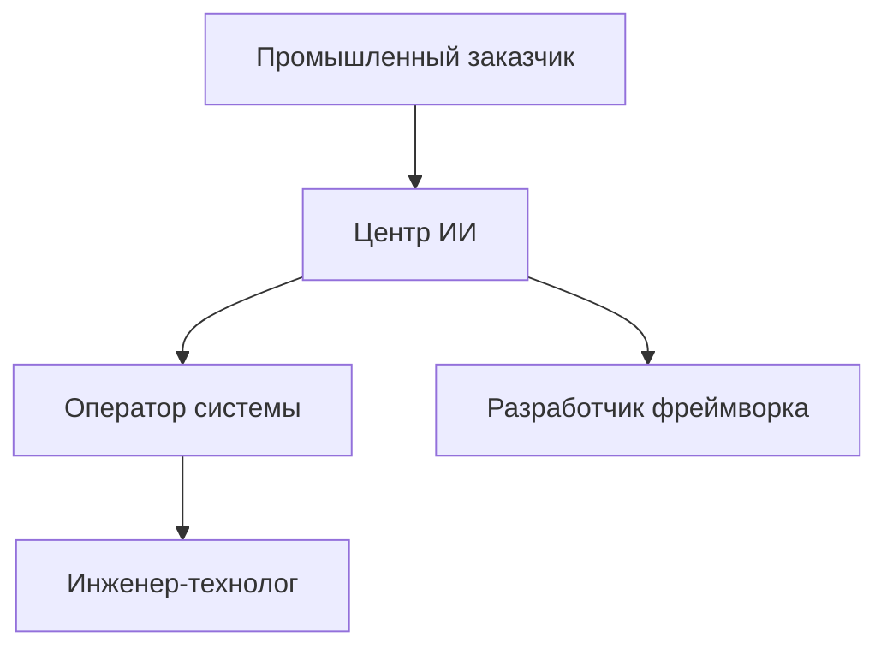
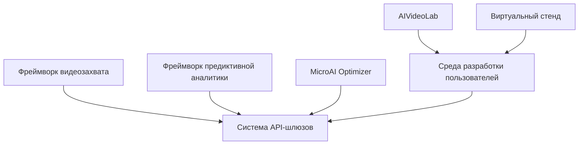
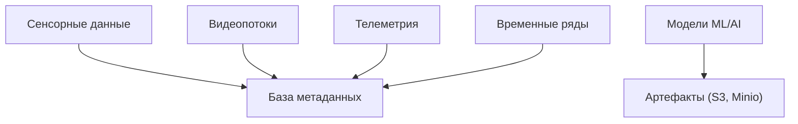
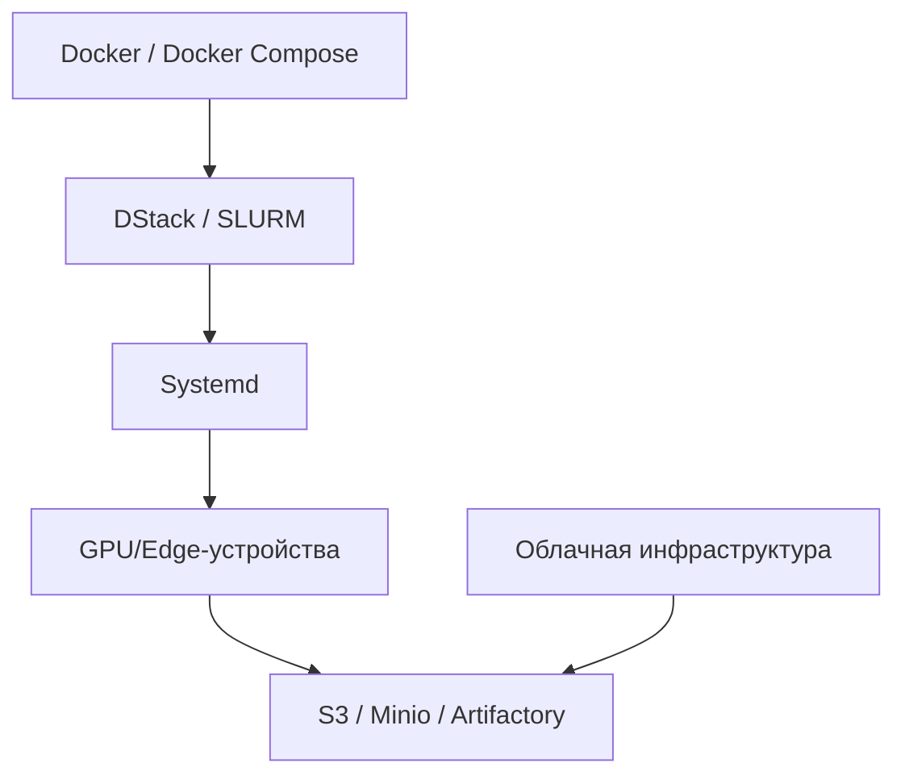

# Архитектура платформы AIoT по TOGAF-уровням

Архитектура агрегирована из всех технических заданий. Для каждого уровня представлены основные компоненты и взаимосвязи.

---

## 📊 Бизнес-уровень (Business Layer)

**Описание:**  
Взаимодействие заказчиков, Центра ИИ, операторов и разработчиков фреймворков. Подразумевается разработка и внедрение решений для промышленных предприятий.

---

## 🧩 Прикладной уровень (Application Layer)

**Описание:**  
Связи между прикладными фреймворками, шлюзами и пользовательскими интерфейсами. Фреймворки связаны через API и единое хранилище артефактов.

---

## 🗂️ Информационный уровень (Data Layer)

**Описание:**  
Основные типы данных в системе: мультимодальные сигналы, модели, телеметрия. Все сохраняется в объектные хранилища и базы метаданных.

---

## ⚙️ Технологический уровень (Technology Layer)

**Описание:**  
Платформа развёртывается в edge/облачной среде. Используются контейнеры, GPU, оркестрация и хранилища артефактов. Поддерживается развёртывание на устройствах с ограниченными ресурсами.
