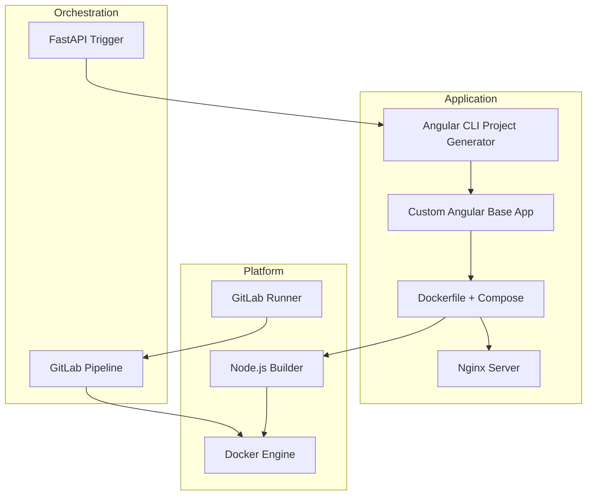

# Архитектура: Базовое Angular-приложение с Docker и CI

## 🧭 TOGAF – Контекст архитектуры

```mermaid
graph TD
    user[User]
    fastapi[FastAPI API]
    docker_host[Docker Host]
    ci_cd[GitLab CI/CD]
    browser[Browser (Test Server)]
    repo[Git Repository]

    user --> fastapi
    fastapi --> docker_host
    docker_host --> repo
    repo --> ci_cd
    ci_cd --> docker_host
    docker_host --> browser
```

---

## 🏗 ODA – Структурная архитектура приложения



---

## 🔄 BPMN – Процесс создания, сборки и деплоя

```mermaid
graph TD
    start([Start]) --> gen[Generate Angular Project]
    gen --> cust[Customize App (Hello World)]
    cust --> build[NPM Install + Build]
    build --> docker[Build Docker Image]
    docker --> test[Test App]
    test --> deploy[Deploy with GitLab CI]
    deploy --> end([End])
```
