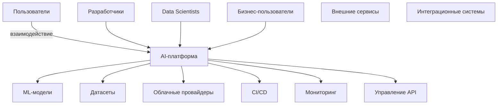
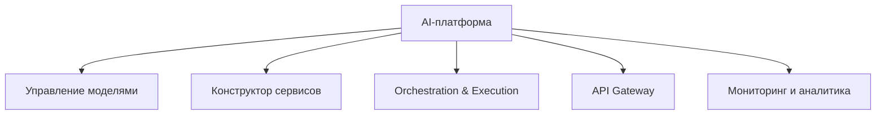
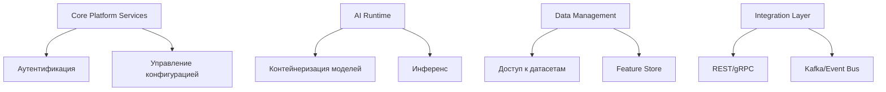
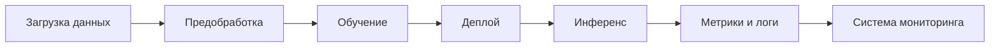
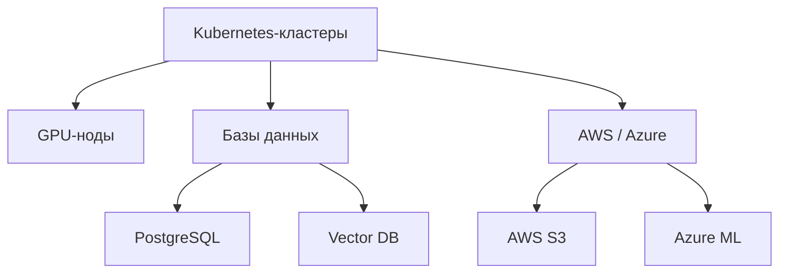
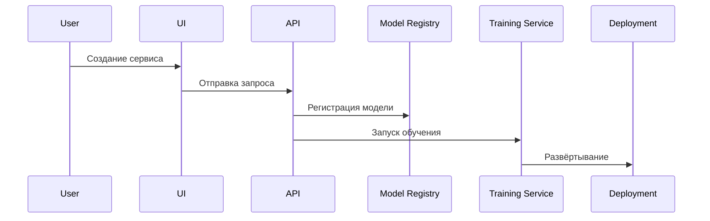
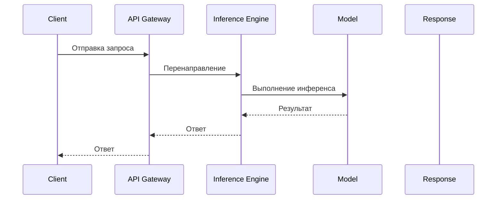
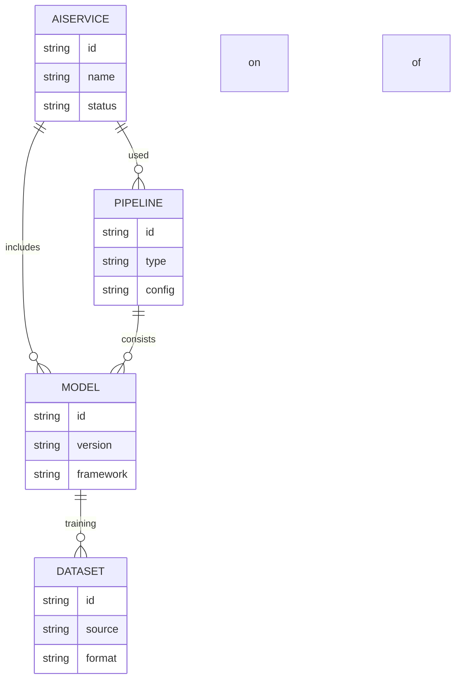

# Диаграммы AI-платформы (Mermaid)

## 1. Контекстная диаграмма
**Показывает основные взаимодействия между пользователями, внешними сервисами и AI-платформой.**

## 2. Функциональная схема
**Структура платформы по ключевым функциям.**

## 3. Компонентная диаграмма
**Подсистемы платформы и их взаимодействие.**

## 4. Диаграмма потоков данных
**Показывает путь данных от загрузки до инференса.**

## 5. Диаграмма развертывания
**Физическая и облачная инфраструктура.**

## 6. Sequence-диаграммы
### a. Создание нового AI-сервиса

### b. Запрос к AI-сервису

## 7. Схема безопасности
**Роли, шифрование и аудит.**
```mermaid
graph TD
    IAM\[Управление доступом \(IAM\)\]
    Admin\[Админ\]
    Dev\[Разработчик\]
    User\[Конечный пользователь\]

    Encryption[Шифрование]
    Transit[In Transit]
    AtRest[At Rest]

    Audit[Аудит доступа]

    IAM --> Admin
    IAM --> Dev
    IAM --> User

    Encryption --> Transit
    Encryption --> AtRest

    Security[Безопасность] --> IAM
    Security --> Encryption
    Security --> Audit
```
## 8. Модель доменных данных
**ER-модель сущностей платформы.**

