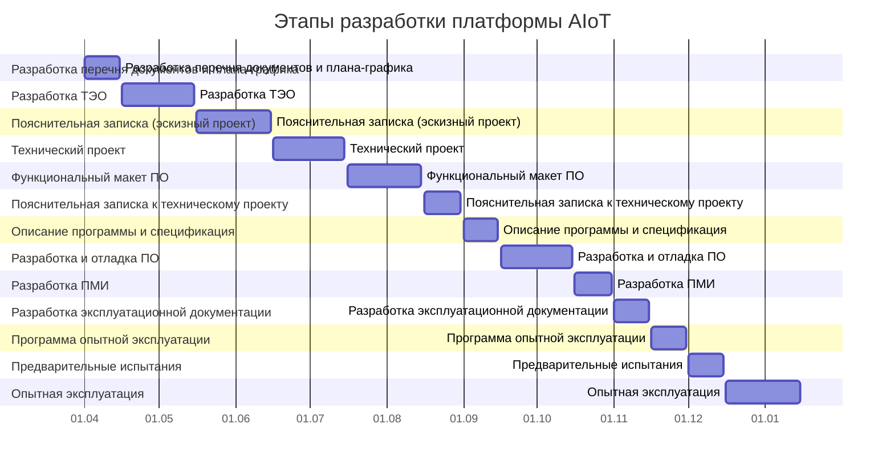

# 📅 Диаграмма Ганта — этапы разработки платформы AIoT (раздел 7)

```mermaid
gantt
    title Этапы разработки платформы AIoT
    dateFormat  YYYY-MM-DD
    axisFormat  %d.%m

    section Разработка перечня документов и плана-графика
    Разработка перечня документов и плана-графика :t1, 2024-04-01, 2024-04-15
    section Разработка ТЭО
    Разработка ТЭО :t2, 2024-04-16, 2024-05-15
    section Пояснительная записка (эскизный проект)
    Пояснительная записка (эскизный проект) :t3, 2024-05-16, 2024-06-15
    section Технический проект
    Технический проект :t4, 2024-06-16, 2024-07-15
    section Функциональный макет ПО
    Функциональный макет ПО :t5, 2024-07-16, 2024-08-15
    section Пояснительная записка к техническому проекту
    Пояснительная записка к техническому проекту :t6, 2024-08-16, 2024-08-31
    section Описание программы и спецификация
    Описание программы и спецификация :t7, 2024-09-01, 2024-09-15
    section Разработка и отладка ПО
    Разработка и отладка ПО :t8, 2024-09-16, 2024-10-15
    section Разработка ПМИ
    Разработка ПМИ :t9, 2024-10-16, 2024-10-31
    section Разработка эксплуатационной документации
    Разработка эксплуатационной документации :t10, 2024-11-01, 2024-11-15
    section Программа опытной эксплуатации
    Программа опытной эксплуатации :t11, 2024-11-16, 2024-11-30
    section Предварительные испытания
    Предварительные испытания :t12, 2024-12-01, 2024-12-15
    section Опытная эксплуатация
    Опытная эксплуатация :t13, 2024-12-16, 2025-01-15
```