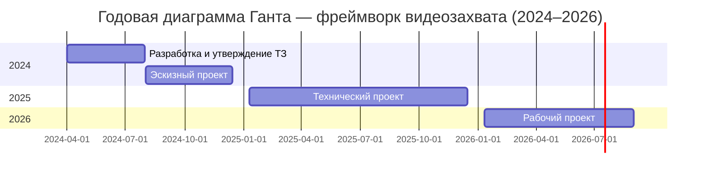

# 📊 Overview — Этапы разработки фреймворка видеозахвата (по п.7 ТЗ 23.08)

| Год | Этап | Сроки | Основное содержание |
|-----|------|-------|---------------------|
| 2024 | Разработка и утверждение ТЗ | 01.04.2024 – 31.07.2024 | Сбор требований, перечень компонентов, цели и архитектура |
| 2024 | Эскизный проект | 01.08.2024 – 15.12.2024 | Архитектура, патентный анализ, описание взаимодействий |
| 2025 | Технический проект | 10.01.2025 – 15.12.2025 | Алгоритмы, интерфейсы, протоколы, спецификация компонентов |
| 2026 | Рабочий проект | 10.01.2026 – 31.08.2026 | Разработка, тестирование, документация, ПМИ, акт приёмки |

