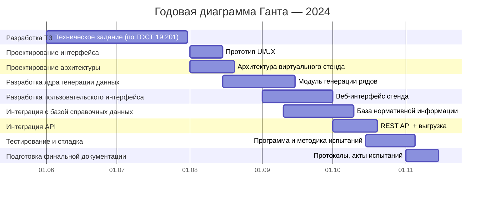
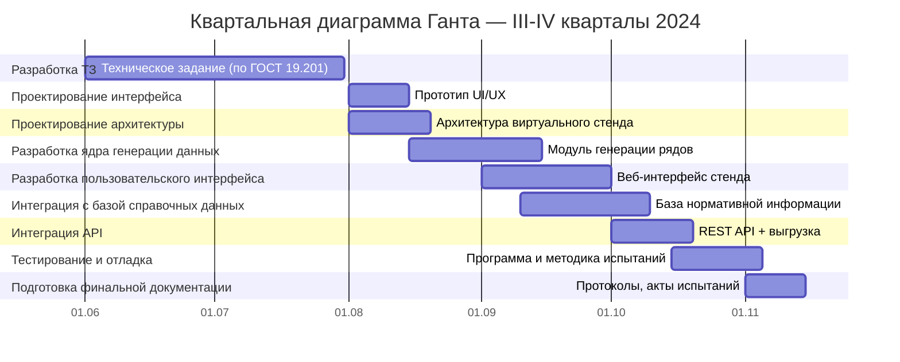

# 📘 План разработки виртуального стенда AIoT (по ТЗ)

## 🚀 Дата начала работ: **01-06-24**
Диаграмма показывает этапы в логике `эпик – артефакт – задача`. Работы выполняет команда из 4 специалистов по 0.5 ставки.
## 📅 Годовая диаграмма Ганта — 2024

## 📅 Квартальная диаграмма Ганта — III-IV кварталы 2024

## 🚩 Контрольные точки и демо

| Дата       | Событие                                | Содержание                                     |
|------------|-----------------------------------------|------------------------------------------------|
| 31-07-24   | Завершение этапа ТЗ                     | Утверждённое ТЗ, согласованное с заказчиком    |
| 15-08-24   | Промежуточное демо №1                   | Архитектура и интерфейс прототипа              |
| 15-09-24   | Промежуточное демо №2                   | Модули генерации и интерфейс генерации данных  |
| 10-10-24   | Промежуточное демо №3                   | Интеграция БД и визуализация                   |
| 05-11-24   | Предфинальное демо                      | API, выгрузка, финальная интеграция            |
| 15-11-24   | Финальное демо и сдача                  | Комплект документации, Акт, Протокол испытаний |
