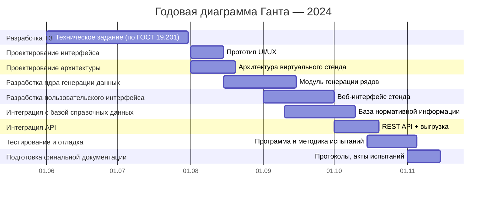
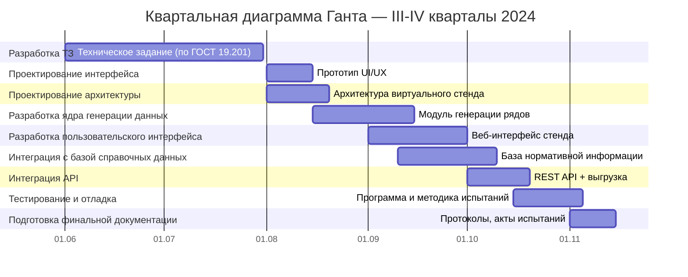

# 📘 План разработки виртуального стенда AIoT

Диаграмма показывает этапы в логике `эпик – артефакт – задача`. Работы выполняет команда из 4 специалистов по 0.5 ставки.
## 📅 Годовая диаграмма Ганта — 2024

## 📅 Квартальная диаграмма Ганта — III-IV кварталы 2024

## 🚩 Контрольные точки и демо

| Дата       | Событие                                | Содержание                                     |
|------------|-----------------------------------------|------------------------------------------------|
| 2024-07-31 | Завершение этапа ТЗ                     | Утверждённое ТЗ, согласованное с заказчиком    |
| 2024-08-15 | Промежуточное демо №1                   | Архитектура и интерфейс прототипа              |
| 2024-09-15 | Промежуточное демо №2                   | Модули генерации и интерфейс генерации данных  |
| 2024-10-10 | Промежуточное демо №3                   | Интеграция БД и визуализация                   |
| 2024-11-05 | Предфинальное демо                      | API, выгрузка, финальная интеграция            |
| 2024-11-15 | Финальное демо и сдача                  | Комплект документации, Акт, Протокол испытаний |
