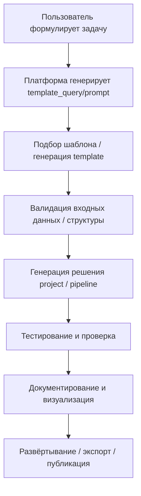
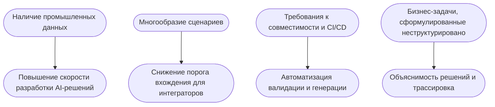
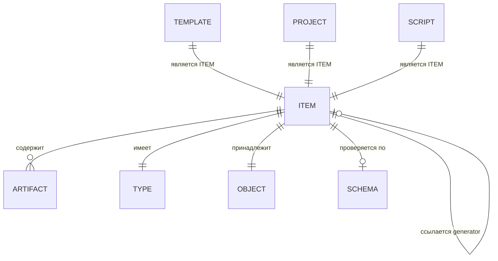
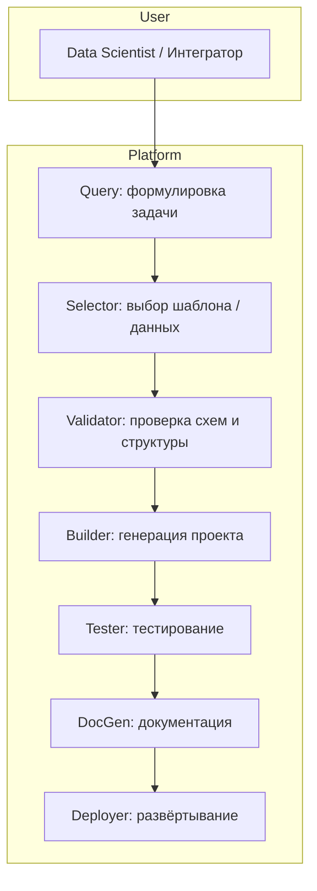
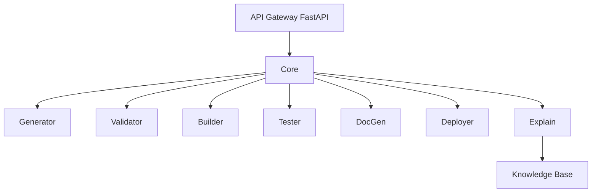
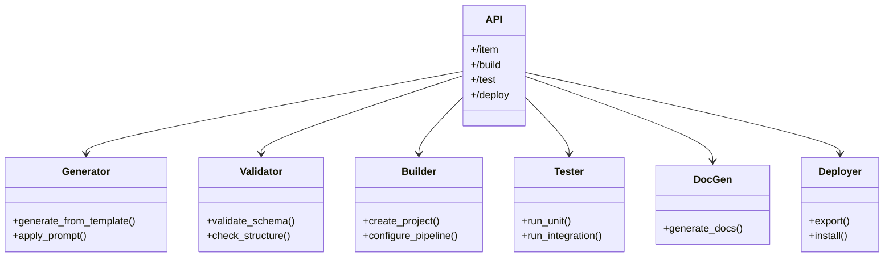
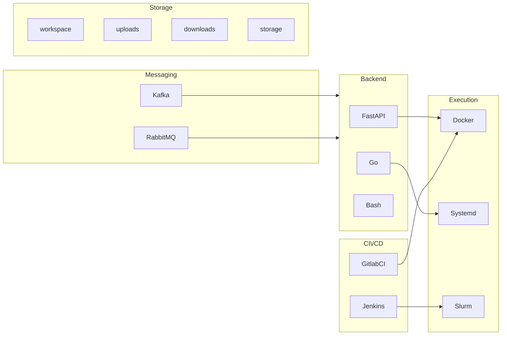
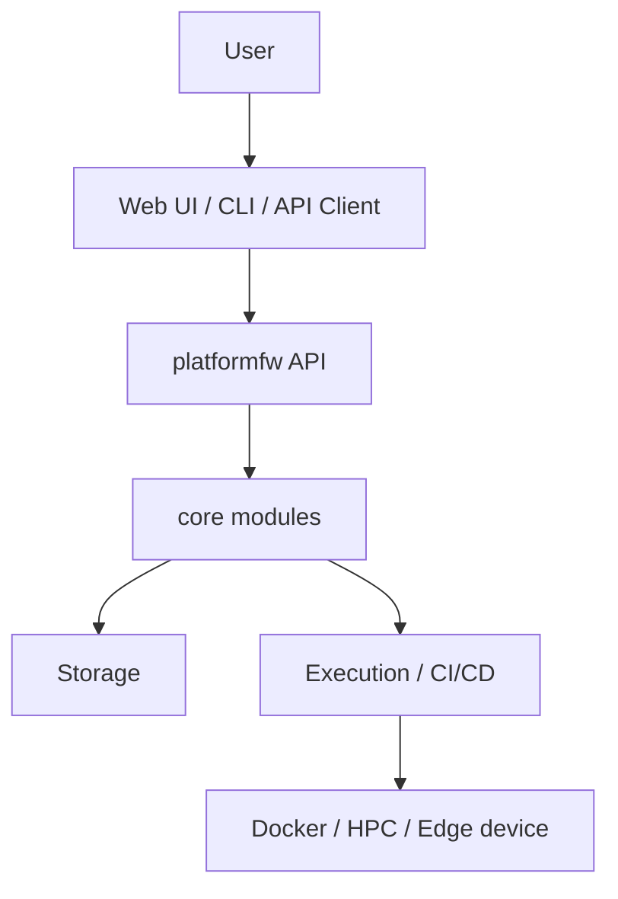
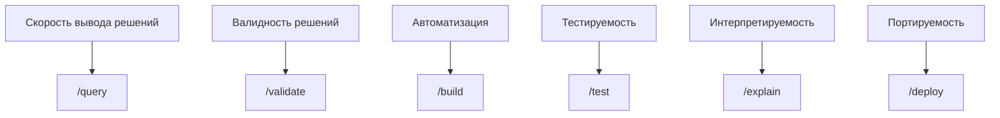
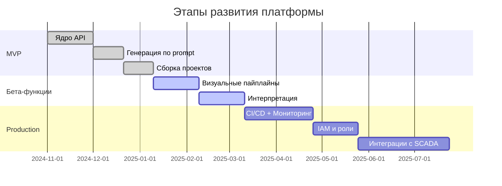

# 📊 Архитектурные диаграммы платформы (Mermaid)

## 1. Business Process Flow (BPMN)

```mermaid
flowchart TD
    A["Пользователь формулирует задачу"] --> B["Платформа генерирует template_query/prompt"]
    B --> C["Подбор шаблона / генерация template"]
    C --> D[Валидация входных данных / структуры]
    D --> E[Генерация решения project / pipeline]
    E --> F[Тестирование и проверка]
    F --> G[Документирование и визуализация]
    G --> H[Развёртывание / экспорт / публикация]
```

## 2. Motivation Model (ArchiMate)

```mermaid
graph TD
    goal1([Повышение скорости разработки AI-решений])
    goal2([Снижение порога вхождения для интеграторов])
    goal3([Автоматизация валидации и генерации])
    goal4([Объяснимость решений и трассировка])

    driver1([Наличие промышленных данных]) --> goal1
    driver2([Многообразие сценариев]) --> goal2
    driver3([Требования к совместимости и CI/CD]) --> goal3
    driver4([Бизнес-задачи, сформулированные неструктурировано]) --> goal4
```

## 3. Data Entity Model (ER)

```mermaid
erDiagram
    ITEM ||--o{ ARTIFACT : "содержит"
    ITEM ||--|| TYPE : "имеет"
    ITEM ||--|| OBJECT : "принадлежит"
    ITEM ||--o| ITEM : "ссылается generator"
    ITEM ||--o| SCHEMA : "проверяется по"
    TEMPLATE ||--|| ITEM : "является ITEM"
    PROJECT ||--|| ITEM : "является ITEM"
    SCRIPT ||--|| ITEM : "является ITEM"
```

## 4. Data Flow Platform (DFD)

```mermaid
flowchart TD
    subgraph User
        U1[Data Scientist / Интегратор]
    end

    subgraph Platform
        Q[Query: формулировка задачи]
        S[Selector: выбор шаблона / данных]
        V[Validator: проверка схем и структуры]
        B[Builder: генерация проекта]
        T[Tester: тестирование]
        D[DocGen: документация]
        R[Deployer: развёртывание]
    end

    U1 --> Q --> S --> V --> B --> T --> D --> R
```

## 5. Application Components (ArchiMate)

```mermaid
flowchart TB
    API[API Gateway FastAPI] --> Core
    Core --> Generator
    Core --> Validator
    Core --> Builder
    Core --> Tester
    Core --> DocGen
    Core --> Deployer
    Core --> Explain
    Explain --> KB[Knowledge Base]
```

## 6. Component Details (UML)

```mermaid
classDiagram
    class API {
        +/item
        +/build
        +/test
        +/deploy
    }
    class Generator {
        +generate_from_template()
        +apply_prompt()
    }
    class Validator {
        +validate_schema()
        +check_structure()
    }
    class Builder {
        +create_project()
        +configure_pipeline()
    }
    class Tester {
        +run_unit()
        +run_integration()
    }
    class DocGen {
        +generate_docs()
    }
    class Deployer {
        +export()
        +install()
    }
    API --> Generator
    API --> Validator
    API --> Builder
    API --> Tester
    API --> DocGen
    API --> Deployer
```

## 7. Technology Stack (ArchiMate)

```mermaid
graph LR
    subgraph Backend
        FastAPI
        Go
        Bash
    end

    subgraph Execution
        Docker
        Systemd
        Slurm
    end

    subgraph CI\/CD
        GitlabCI
        Jenkins
    end

    subgraph Messaging
        Kafka
        RabbitMQ
    end

    subgraph Storage
        workspace
        uploads
        downloads
        storage
    end

    FastAPI --> Docker
    Go --> Systemd
    Jenkins --> Slurm
    GitlabCI --> Docker
    Kafka --> Backend
    RabbitMQ --> Backend
```

## 8. Deployment View (UML)

```mermaid
flowchart TD
    User --> UI[Web UI / CLI / API Client]
    UI --> API[platformfw API]
    API --> Core[core modules]
    Core --> Storage
    Core --> Compute[Execution / CI/CD]
    Compute --> Server[Docker / HPC / Edge device]
```

## 9. Traceability Matrix (TOGAF)

```mermaid
graph TD
    goalA["Скорость вывода решений"] --> Q1["/query"]
    goalB["Валидность решений"] --> validate["/validate"]
    goalC["Автоматизация"] --> build["/build"]
    goalD["Тестируемость"] --> test["/test"]
    goalE["Интерпретируемость"] --> explain["/explain"]
    goalF["Портируемость"] --> deploy["/deploy"]
```

## 10. Roadmap Phases (ArchiMate)

```mermaid
gantt
    title Этапы развития платформы
    dateFormat  YYYY-MM-DD
    section MVP
    Ядро API               :done, a1, 2024-11-01, 30d
    Генерация по prompt    :done, a2, after a1, 20d
    Сборка проектов        :done, a3, after a2, 20d

    section Бета-функции
    Визуальные пайплайны   :active, a4, after a3, 30d
    Интерпретация          :active, a5, after a4, 30d

    section Production
    CI/CD + Мониторинг     :a6, after a5, 45d
    IAM и роли             :a7, after a6, 30d
    Интеграции с SCADA     :a8, after a7, 60d
```
