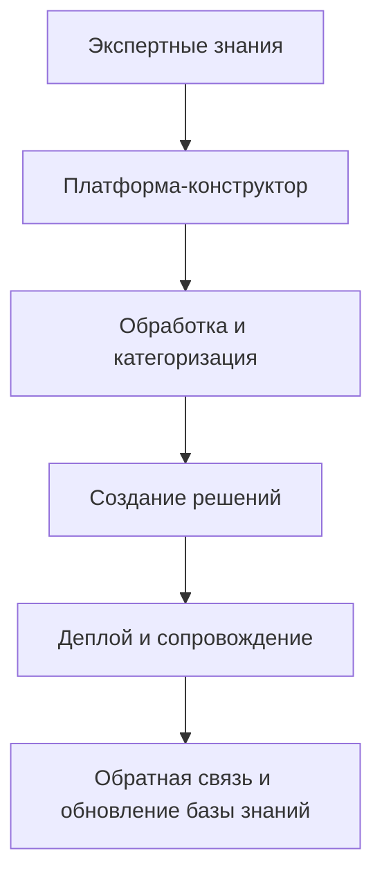
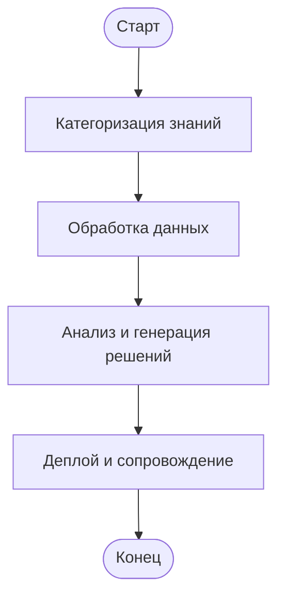
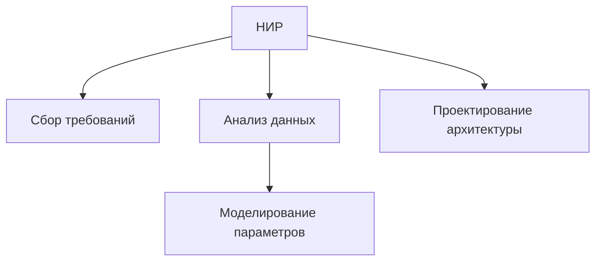
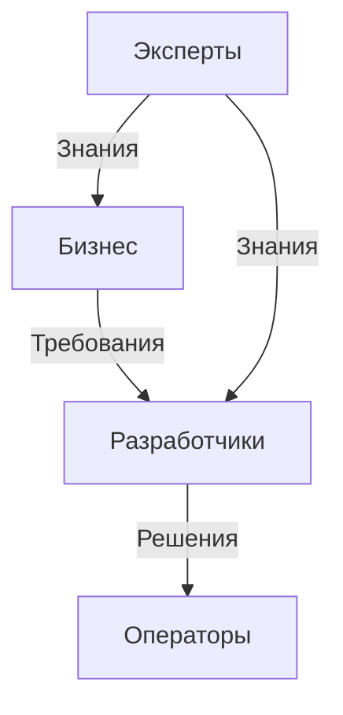
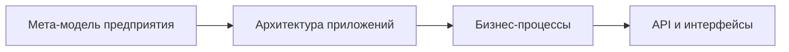
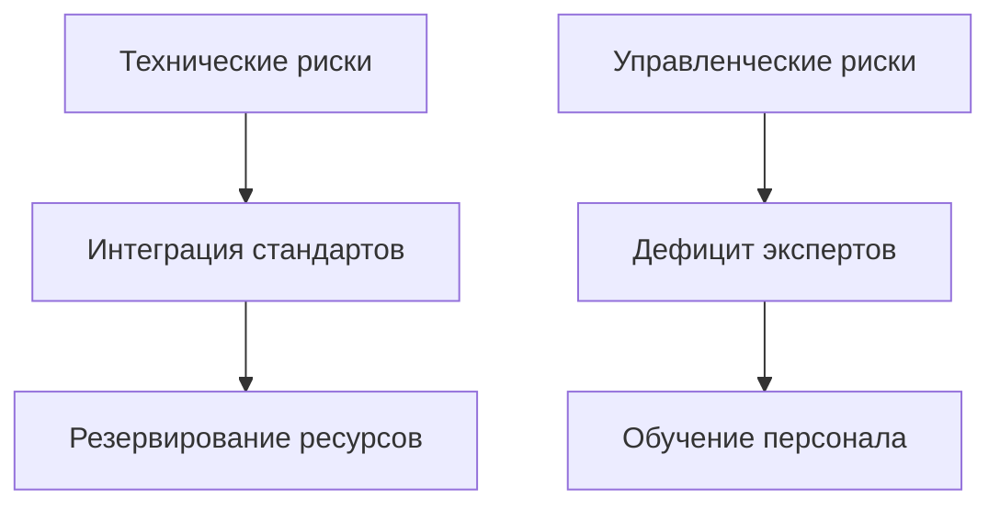
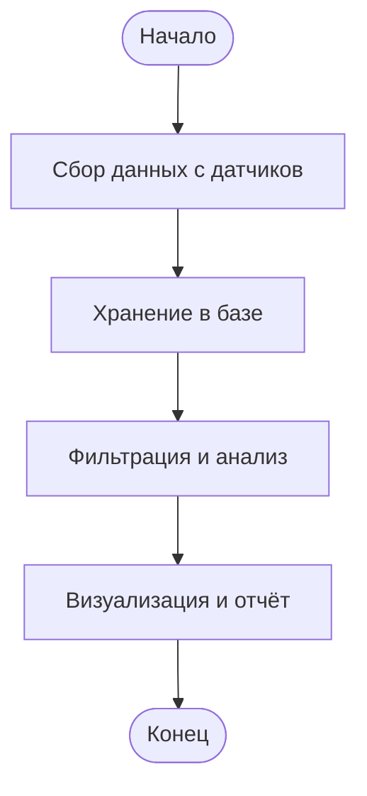
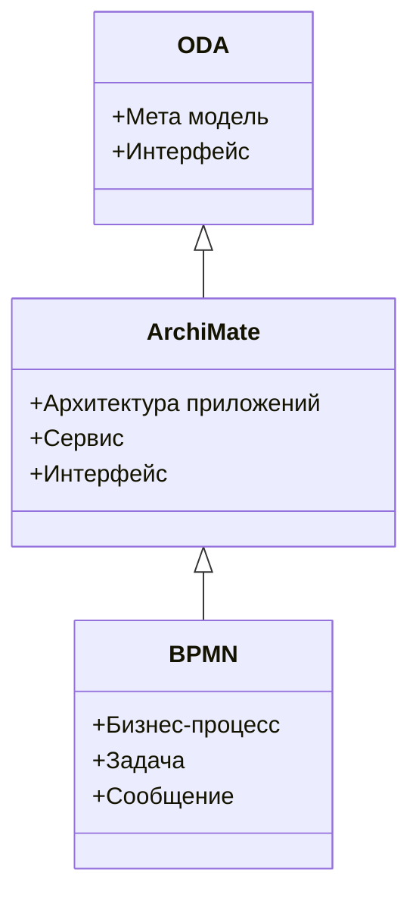
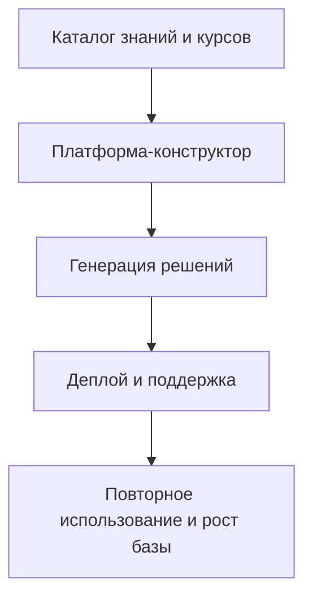

# Титульный слайд

**Архитектура платформы-конструктора для автоматизации жизненного цикла решений на основе экспертных знаний и отраслевых компетенций**

Подзаголовок: Создание новых решений для бизнеса через обобщение экспертных знаний и отраслевых стандартов
Логотипы: Компании, партнеров, deep-vision.one
Дата: [Дата презентации]

# Введение

Цель презентации: Показать, как платформа-конструктор создает новые решения для бизнеса, обобщая экспертные знания и отраслевые компетенции.
Ключевые выгоды:
- Ускорение разработки решений за счет использования базы категоризированных знаний.
- Поддержка отраслевых стандартов (ТЭК, электроэнергетика, химическая промышленность, машиностроение).
- Автоматизация анализа данных через моделирование управляющих параметров.
- Примеры: Курсы и решения, созданные на платформе, уже используются в энергетике и машиностроении.




# Концепция архитектуры

Мета модели: Используются для описания архитектуры на всех уровнях — от предприятия до конкретных операций.
Нотации:
- ODA: Для описания архитектуры предприятия.
- ArchiMate: Для описания приложений и сервисов.
- BPMN: Для описания бизнес-процессов.
Связь с deep-vision.one: Используем терминологию и концепции, такие как 'элементы бизнес-архитектуры'.

```mermaid
graph LR
    A[Уровень предприятия (ODA)] --> B[Уровень приложений (ArchiMate)]
    B --> C[Уровень процессов (BPMN)]
    C --> D[Реализация API и микросервисов]
```


# Карта основных и вспомогательных процессов

Основные процессы:
- Сбор и категоризация экспертных знаний.
- Обработка данных с учетом отраслевых стандартов.
- Генерация новых решений.
Вспомогательные процессы:
- Управление знаниями.
- Обучение и пополнение базы знаний.
Пример: Процесс создания курса для энергетики на основе стандартов ТЭК.




# Декомпозиция процессов (этап НИР)

Этап НИР: Включает сбор требований, анализ данных, проектирование решений.
Декомпозиция:
- Сбор данных: Экспертные знания, отраслевые стандарты.
- Анализ: Моделирование управляющих параметров.
- Проектирование: Создание новых решений.
Пример: Декомпозиция процесса анализа данных для химической промышленности.




# Стейкхолдеры

Ключевые стейкхолдеры:
- Владельцы бизнеса: Определяют требования.
- Эксперты: Пополняют базу знаний.
- Разработчики: Реализуют решения.
- Операторы: Обеспечивают поддержку.
Пример: Роль экспертов в пополнении базы знаний для машиностроения.




# Переходы между слоями и уровнями

Переходы:
- От уровня метамодели предприятия (ODA) до уровня API (ArchiMate).
Обоснование:
- ODA для стратегического уровня, ArchiMate для тактического, BPMN для операционного.
Пример: Переход от описания бизнес-архитектуры предприятия до реализации API для анализа данных.




# Оценка рисков

Риски:
- Технические: Сложность интеграции с отраслевыми стандартами.
- Управленческие: Недостаток экспертных знаний.
План управления рисками:
- Резервирование ресурсов.
- Постоянное обучение и пополнение базы знаний.




# Примеры бизнес-процессов

Пример 1: Процесс сбора и анализа данных для электроэнергетики.
Пример 2: Процесс создания курса для химической промышленности.
Пример 3: Процесс моделирования управляющих параметров для машиностроения.




# Глоссарий

Термины:
- Мета модель: Описание архитектуры на высоком уровне.
- Микро сервис: Независимый компонент системы.
- API: Интерфейс для взаимодействия между системами.
Сопоставление терминов: ODA, ArchiMate, BPMN.




# Заключение

Резюме: Платформа создает новые решения, обобщая экспертные знания и отраслевые компетенции.
Дальнейшие шаги: Уточнение требований, разработка прототипа, тестирование.
Вопросы и ответы: Обсуждение и ответы на вопросы.



