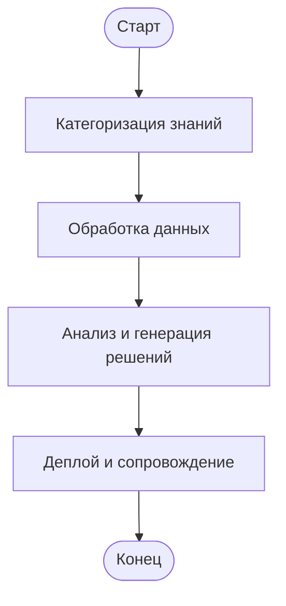
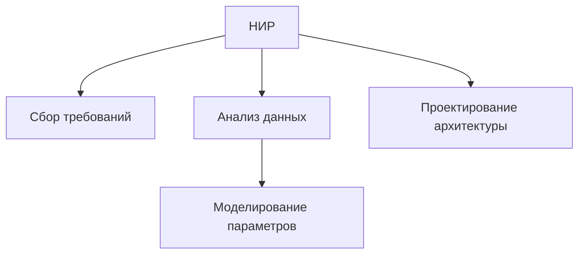

# Архитектура платформы-конструктора

**Создание новых решений для бизнеса через обобщение экспертных знаний и отраслевых стандартов**

Дата: [Дата презентации]
Логотипы: Компании, партнеров, deep-vision.one

# Введение

Цель: Показать, как платформа создает решения, обобщая знания и компетенции.
Преимущества: ускорение разработки, поддержка отраслевых стандартов, моделирование параметров.

# Концепция архитектуры

Мета-модели: описание архитектуры на всех уровнях.
Нотации: ODA (предприятие), ArchiMate (приложения), BPMN (процессы).
Связь с deep-vision.one: элементы бизнес-архитектуры.

```mermaid
graph LR
    A[Уровень предприятия (ODA)] --> B[Уровень приложений (ArchiMate)]
    B --> C[Уровень процессов (BPMN)]
    C --> D[Реализация API и микросервисов]
```


# Карта основных и вспомогательных процессов

Основные процессы: сбор знаний, обработка данных, генерация решений.
Вспомогательные: управление знаниями, обучение, пополнение базы.




# Декомпозиция процессов (этап НИР)

НИР включает: сбор требований, анализ, проектирование.
Пример: анализ данных в химической промышленности.



