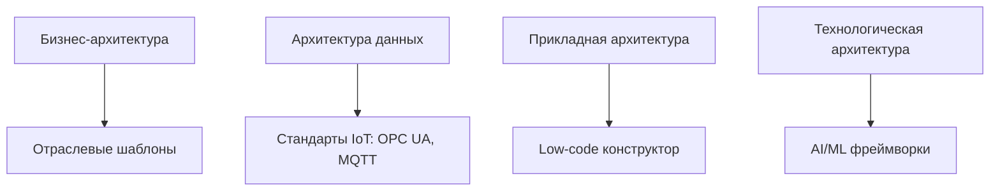
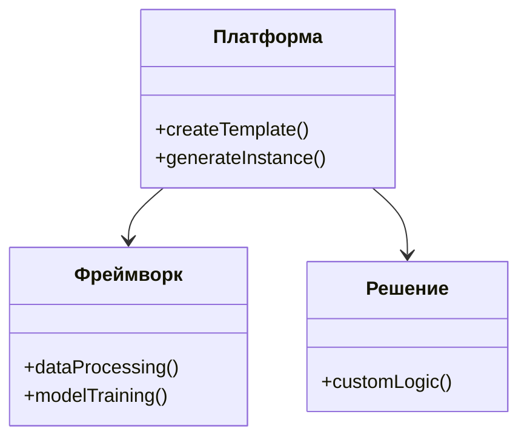
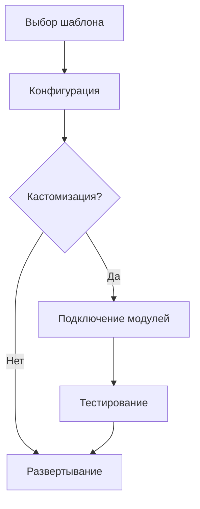
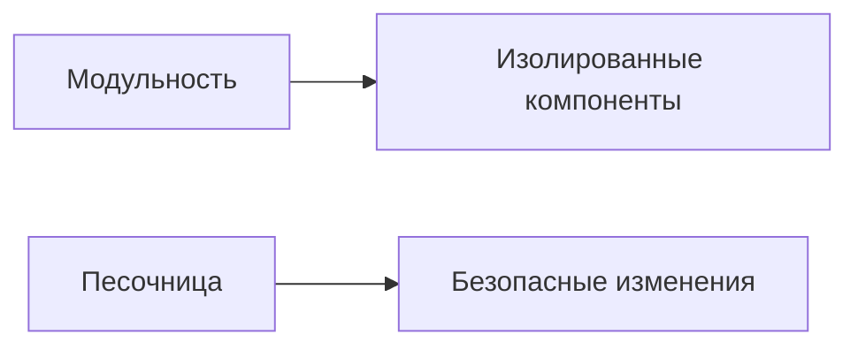
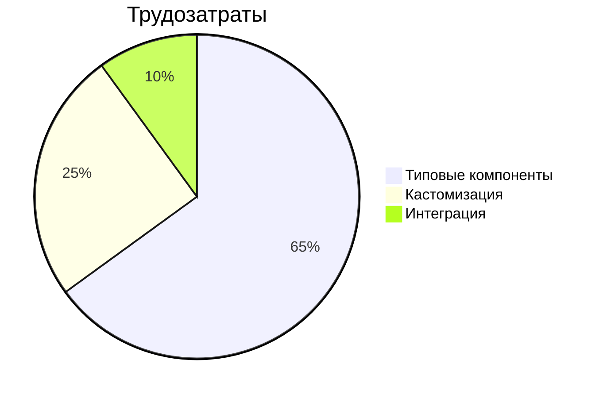
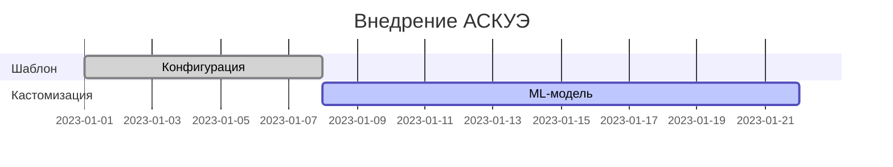
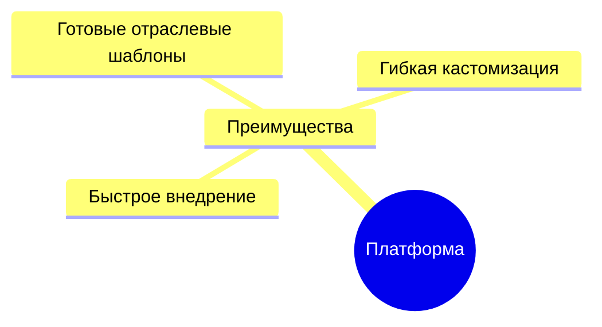
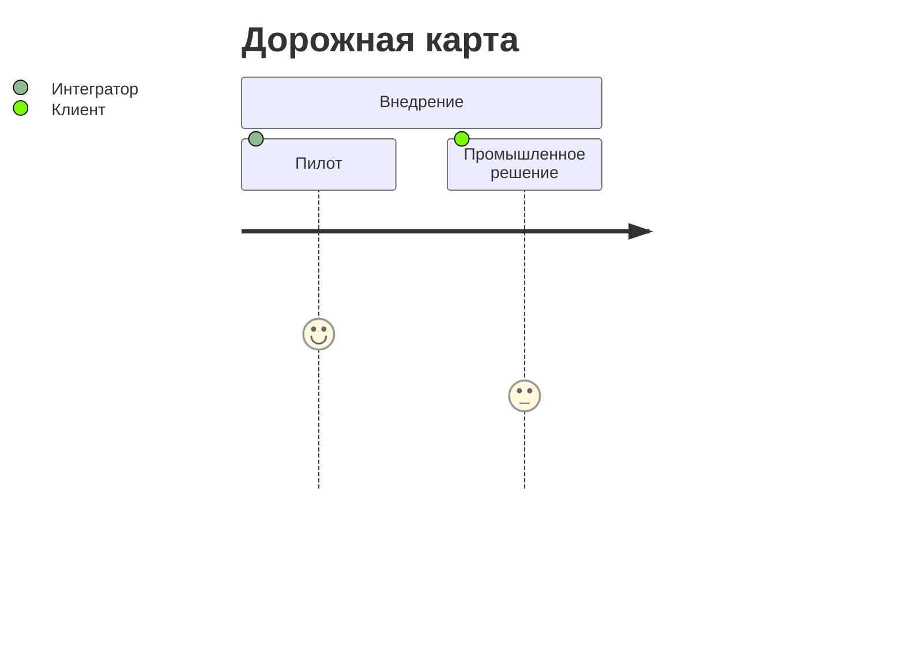

# Архитектура AIoT-платформы для интеграторов

## 1. Позиционирование в TOGAF

**Сущности платформы:**
- **Платформа**: Генератор шаблонов/экземпляров
- **Фреймворк**: Библиотека методов (аналитика данных, обучение моделей)
- **Решение**: Кастомный экземпляр (напр., ML-модель для нагрузок в Э/Э)

---

## 2. Компонентная архитектура

**Типовые элементы:**
| Тип | Пример |
|-----|--------|
| Типовая задача | Анализ данных приборов учета |
| Типовой фронт | Дашборд энергопотребления |
| Типовой бэкенд | Сервис прогнозирования |

---

## 3. Процесс сборки решения

**Экономия времени:**
- С 6 месяцев → 3 недели

---

## 4. Гибкость кастомизации

**Пример:**
1. Берем шаблон АСКУЭ
2. Добавляем кастомную ML-модель
3. Сохраняем как новый шаблон

---

## 5. ROI для интегратора

**Выгоды:**
- Снижение стоимости проектов на 40-60%
- Переиспользование шаблонов

---

## 6. Пример внедрения

---

## 7. Отличия от конкурентов

---

## 8. Следующие шаги

