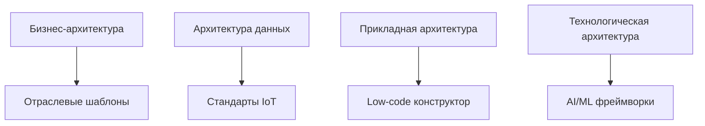
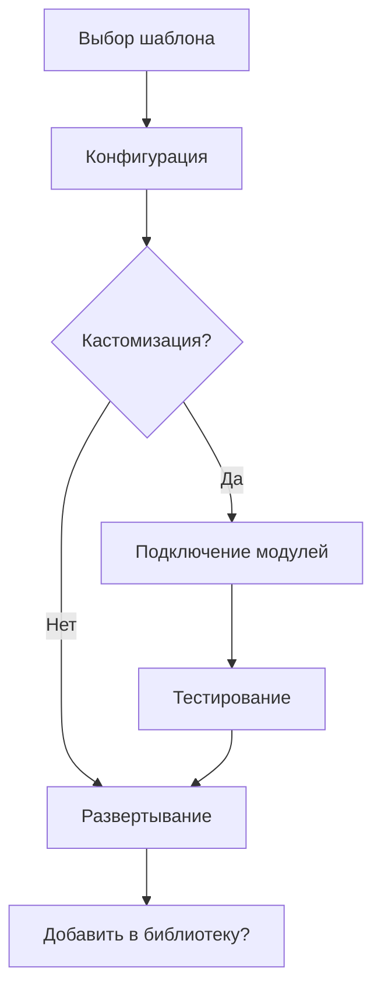
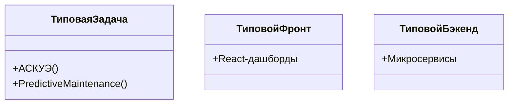
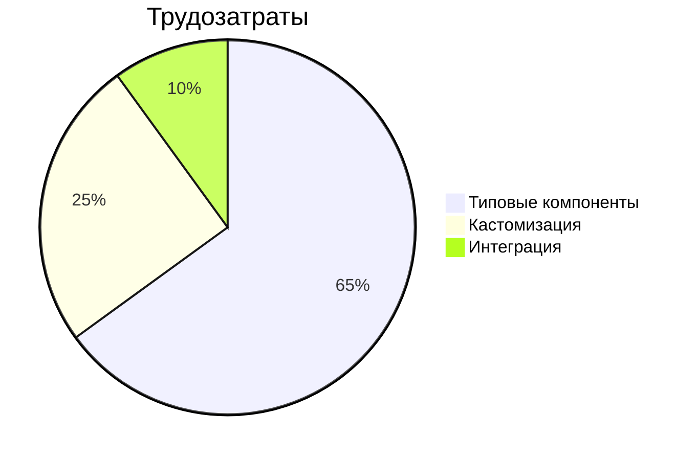
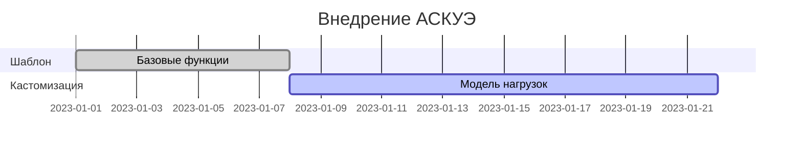
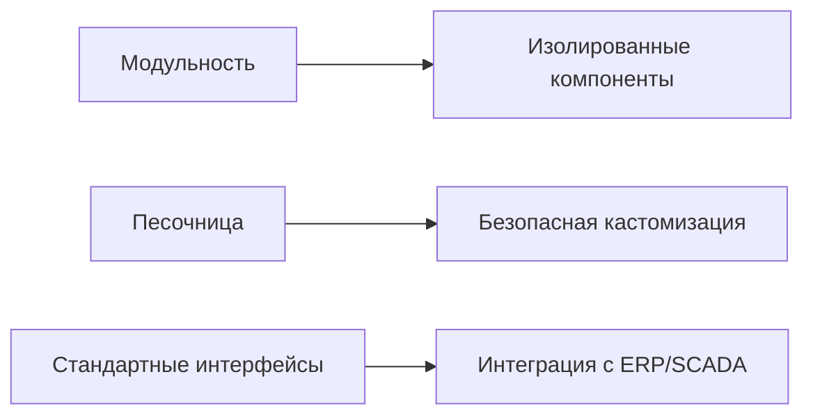
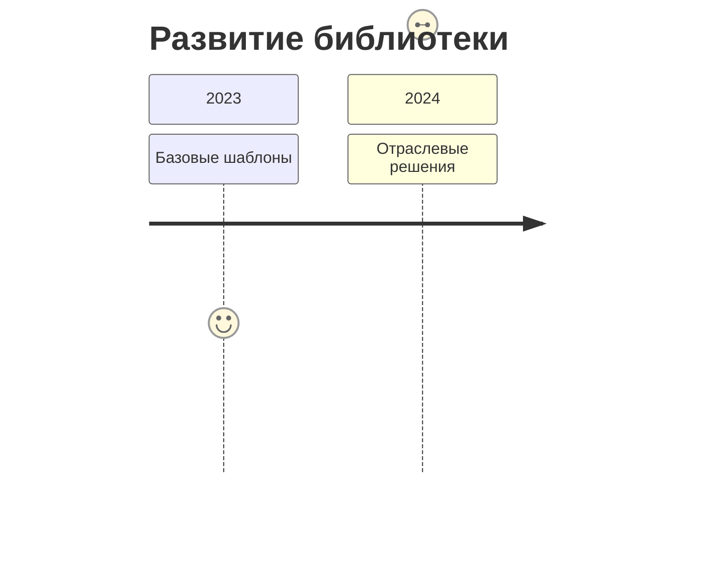

# Архитектура AIoT-платформы как конструктора решений (TOGAF-совместимая)

## 1. Ценностное предложение
**«Сокращаем R&D-затраты на 60% через повторное использование типовых компонентов»**

## 2. Позиционирование в TOGAF

## 3. Ключевые сущности
| Термин          | Определение                          | Пример                  |
|-----------------|-------------------------------------|-------------------------|
| **Платформа**   | Генератор шаблонов/экземпляров       | Функция "Создать шаблон АСКУЭ" |
| **Фреймворк**   | Библиотека типовых методов           | Методы анализа данных приборов учета |
| **Решение**     | Кастомный экземпляр                  | ML-модель для конкретной электросети |

## 4. Процесс сборки

ии — диаграммы UML/SysML с компонентами.

## 5. Типовые компоненты

## 6. Экономика для интегратора

## 7. Пример: Энергетика

## 8. Гибкость архитектуры

## 9. ROI-преимущества
- **Сроки внедрения**: 6 мес → 3 нед
- **Стоимость**: -40-60% vs кастомная разработка
- **Монетизация**: White-label для интеграторов

## 10. Эволюция платформы

