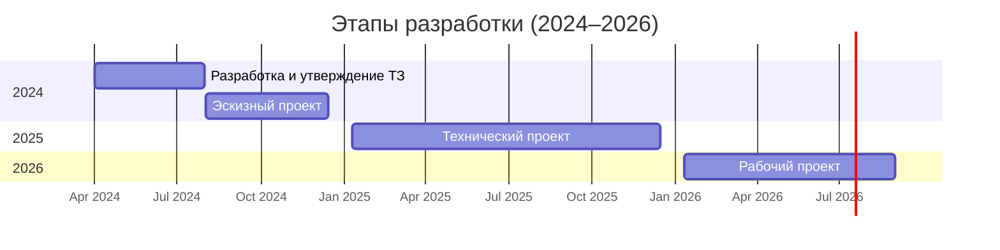

# 🧠 Презентация проекта: Фреймворк видеозахвата AIoT (ТЗ 23.08)

---

## 🎯 Цель проекта

Создание промышленного фреймворка для видеозахвата, обработки и онлайн-фильтрации видеопотоков с использованием гетерогенных источников (RTSP, GenICam, UDP) и интеграцией с платформой AIoT.

---

## 👥 Команда

- 1 инженер по потоковой обработке (0.5 ставки)
- 1 ML-специалист по фильтрации и аналитике (0.5 ставки)
- 1 инженер по тестированию и отладке (0.5 ставки)

---

## 🔧 Основные компоненты фреймворка

| Компонент | Назначение |
|-----------|------------|
| Программный компонент: «Конфигуратор источников данных» | Настройка и управление источниками видеопотока |
| Программный компонент: «Валидатор данных» | Проверка корректности описания и состояния источников |
| Программный компонент: «Общая память» | Организация буферизации данных для параллельного доступа |
| Программный компонент: «API-шлюз» | Валидация запросов и асинхронное взаимодействие через брокер сообщений |
| Программный компонент: «Сервер обработки запросов по API» | Работа с источниками, доставка данных, логика API |
| Программный компонент: «Библиотека алгоритмов видеозахвата» | Захват потоков GenICam / UDP / RTSP, синхронизация |
| Программный компонент: «Библиотека детекции объектов» | Онлайн-фильтрация и обнаружение объектов |
| Программный компонент: «Примеры использования» | Скрипты и демо применения API и фильтров |
| Программный компонент: «Инструмент тестирования и оценки» | Модульное тестирование API и библиотек |
| Программный компонент: «База данных» | Хранение метаданных, конфигураций, логов |

---

## 🔁 План разработки (эпик → артефакт → задача)

Задачи рассчитаны на 40–80 часов работы при 0.5 ставки.

| Эпик | Артефакт | Задача | Роль | Трудоёмкость (ч) |
|------|-----------|--------|------|------------------|
| Настройка источников | Конфигуратор источников данных | Реализовать интерфейс ввода параметров источников | streaming | 20 |
| Настройка источников | Конфигуратор источников данных | Сделать поддержку 3 типов камер: RTSP, UDP, GenICam | streaming | 20 |
| Настройка источников | Конфигуратор источников данных | Интегрировать проверку доступности источников | streaming | 16 |
| Валидация данных | Валидатор данных | Разработать схему описания источников | ml | 16 |
| Валидация данных | Валидатор данных | Реализовать проверку структуры и типов данных | ml | 20 |
| Валидация данных | Валидатор данных | Добавить отчёт об ошибках валидации | ml | 12 |
| Организация памяти | Общая память | Разработать структуру буфера для хранения кадров | streaming | 20 |
| Организация памяти | Общая память | Добавить механизмы блокировок и синхронизации | streaming | 16 |
| Организация памяти | Общая память | Реализовать тестовый прототип параллельного чтения | test | 16 |
| Сетевое взаимодействие | API-шлюз | Реализовать REST-интерфейс регистрации источников | streaming | 16 |
| Сетевое взаимодействие | API-шлюз | Добавить поддержку WebSocket для мониторинга | streaming | 20 |
| Обработка запросов | Сервер обработки запросов по API | Организовать очередь сообщений через брокер | streaming | 16 |
| Обработка запросов | Сервер обработки запросов по API | Интегрировать API-шлюз с логикой видеозахвата | streaming | 20 |
| Захват видео | Библиотека алгоритмов видеозахвата | Имплементировать RTSP-захват | streaming | 16 |
| Захват видео | Библиотека алгоритмов видеозахвата | Имплементировать GenICam-поток | streaming | 20 |
| Захват видео | Библиотека алгоритмов видеозахвата | Тестовая запись потока в память | test | 16 |
| Обнаружение объектов | Библиотека детекции объектов | Добавить онлайн-фильтр движения | ml | 20 |
| Обнаружение объектов | Библиотека детекции объектов | Интеграция YOLOv5/RT модель | ml | 24 |
| Обнаружение объектов | Библиотека детекции объектов | Тестировать стабильность фильтра | test | 12 |
| Демонстрация работы | Примеры использования | Написать 3 демонстрационных скрипта запуска | test | 12 |
| Тестирование | Инструмент тестирования и оценки | Подготовить модульные тесты API | test | 16 |
| Тестирование | Инструмент тестирования и оценки | Проверка работоспособности потоков | test | 16 |
| Работа с конфигурациями | База данных | Схема хранения: источники, сессии, ошибки | ml | 16 |
| Работа с конфигурациями | База данных | Настроить PostgreSQL + SQLAlchemy модели | ml | 20 |

---

## 🗂️ Обзор этапов разработки (2024–2026)

| Год | Этап | Сроки | Основное содержание |
|-----|------|-------|---------------------|
| 2024 | Разработка и утверждение ТЗ | 01.04.2024 – 31.07.2024 | Сбор требований, перечень компонентов, цели и архитектура |
| 2024 | Эскизный проект | 01.08.2024 – 15.12.2024 | Архитектура, патентный анализ, описание взаимодействий |
| 2025 | Технический проект | 10.01.2025 – 15.12.2025 | Алгоритмы, интерфейсы, спецификация компонентов |
| 2026 | Рабочий проект | 10.01.2026 – 31.08.2026 | Код, тестирование, документация, акт приёмки |

---

## 📆 Годовой Гант по этапам

---

## 📍 Демонстрации и контрольные точки (1 раз в квартал минимум)

| Дата | Демонстрация |
|------|--------------|
| 31.07.2024 | 📄 Утверждённое ТЗ, описание компонентов |
| 15.10.2024 | 🧩 Архитектура и структура API |
| 15.01.2025 | ⚙️ Интерфейсы и логика API-шлюза |
| 15.04.2025 | 📸 Потоковый захват и фильтрация |
| 15.07.2025 | 📦 Интеграция с базой и конфигурациями |
| 15.10.2025 | 🧪 Юнит- и интеграционные тесты |
| 31.08.2026 | 📋 Финальное демо: приёмка, ПМИ, акт

---
