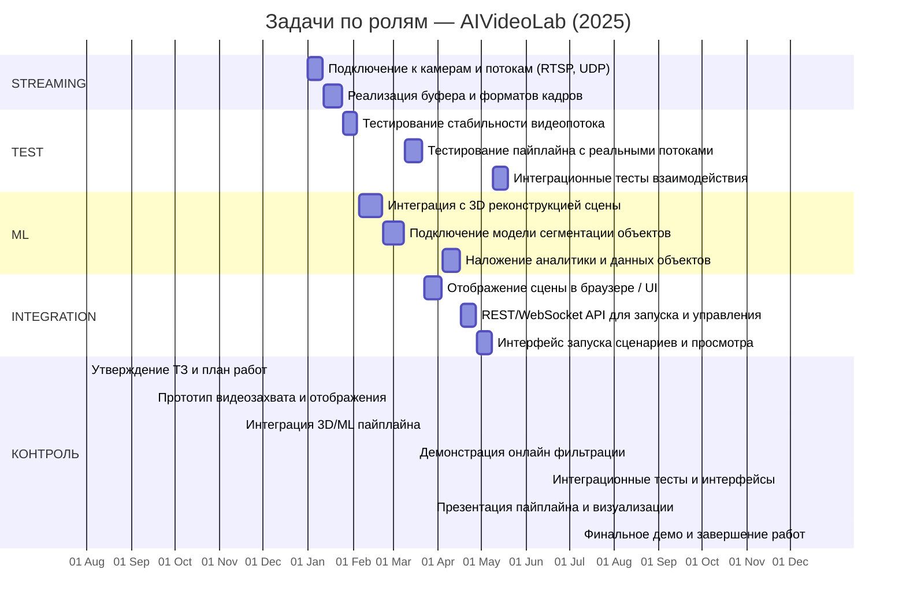

# 🎯 Проект: AIVideoLab (AIoT)

## 🧠 Цель
Создание модуля видеозахвата и 3D/ML-пайплайна с отображением и управлением для AIoT.

## 👥 Команда
- Потоковый инженер (0.5)
- ML-специалист (0.5)
- Интегратор (0.5)
- Тестировщик (0.5)

## 🔧 Компоненты

| Компонент | Назначение |
|-----------|------------|
| Компонент видеопотока | Захват и буферизация видеоданных от источников |
| Компонент 3D/ML-пайплайна | Интеграция с алгоритмами реконструкции и аналитики |
| Компонент визуализации | Отображение сцен и аналитики в режиме реального времени |
| Компонент взаимодействия | API и Web-интерфейсы, включая вызов плагинов и управление сценами |

## 📅 Этапы (по п.7 ТЗ)

| Этап | Начало | Окончание |
|------|--------|-----------|
| Формирование технического задания | 01-06-2024 | 31-07-2024 |
| Разработка рабочего проекта | 01-08-2024 | 15-11-2024 |
| Реализация, настройка и тестирование | 01-01-2025 | 15-12-2025 |

## 📌 Контрольные точки

| Дата | Событие |
|------|---------|
| 31.07.2024 | 📄 Утверждение ТЗ и план работ |
| 15.09.2024 | 📦 Прототип видеозахвата и отображения |
| 15.11.2024 | 🧠 Интеграция 3D/ML пайплайна |
| 15.03.2025 | 📸 Демонстрация онлайн фильтрации |
| 15.06.2025 | 🧪 Интеграционные тесты и интерфейсы |
| 15.09.2025 | 📊 Презентация пайплайна и визуализации |
| 15.12.2025 | ✅ Финальное демо и завершение работ |

## 🗂️ Декомпозиция задач (40–80 ч)

| Эпик | Артефакт | Задача | Роль | Трудоёмкость (ч) |
|------|-----------|--------|------|------------------|
| Захват и буферизация | Компонент видеопотока | Подключение к камерам и потокам (RTSP, UDP) | streaming | 40 |
| Захват и буферизация | Компонент видеопотока | Реализация буфера и форматов кадров | streaming | 48 |
| Захват и буферизация | Компонент видеопотока | Тестирование стабильности видеопотока | test | 40 |
| Обработка и реконструкция | Компонент 3D/ML-пайплайна | Интеграция с 3D реконструкцией сцены | ml | 64 |
| Обработка и реконструкция | Компонент 3D/ML-пайплайна | Подключение модели сегментации объектов | ml | 56 |
| Обработка и реконструкция | Компонент 3D/ML-пайплайна | Тестирование пайплайна с реальными потоками | test | 48 |
| Отображение и визуализация | Компонент визуализации | Отображение сцены в браузере / UI | integration | 48 |
| Отображение и визуализация | Компонент визуализации | Наложение аналитики и данных объектов | ml | 48 |
| API и взаимодействие | Компонент взаимодействия | REST/WebSocket API для запуска и управления | integration | 40 |
| API и взаимодействие | Компонент взаимодействия | Интерфейс запуска сценариев и просмотра | integration | 40 |
| API и взаимодействие | Компонент взаимодействия | Интеграционные тесты взаимодействия | test | 40 |
|  |  | **Итого** |  | 512 |

## 📊 Диаграмма задач по ролям

