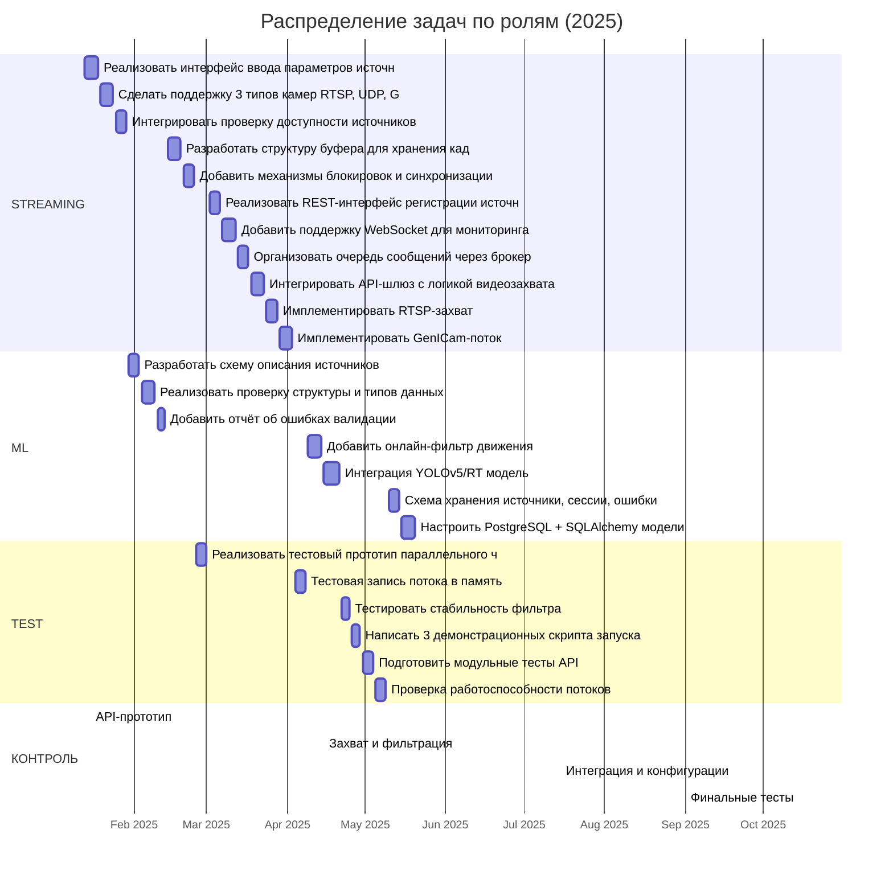

# 🎯 Проект: Фреймворк видеозахвата AIoT (ТЗ 23.08)

## 🧠 Цель
Создание промышленного фреймворка видеозахвата, фильтрации и наблюдения потоков с разных источников с интеграцией в платформу AIoT.

## 👥 Команда
- Инженер потоковой обработки — 0.5 ставки
- ML-специалист — 0.5 ставки
- Тестировщик — 0.5 ставки

## 🔧 Программные компоненты

| Компонент | Назначение |
|-----------|------------|
| Программный компонент: «Конфигуратор источников данных» | Настройка и управление источниками видеопотока |
| Программный компонент: «Валидатор данных» | Проверка корректности описания и состояния источников |
| Программный компонент: «Общая память» | Организация буферизации данных для параллельного доступа |
| Программный компонент: «API-шлюз» | Валидация запросов и асинхронное взаимодействие через брокер сообщений |
| Программный компонент: «Сервер обработки запросов по API» | Работа с источниками, доставка данных, логика API |
| Программный компонент: «Библиотека алгоритмов видеозахвата» | Захват потоков GenICam / UDP / RTSP, синхронизация |
| Программный компонент: «Библиотека детекции объектов» | Онлайн-фильтрация и обнаружение объектов |
| Программный компонент: «Примеры использования» | Скрипты и демо применения API и фильтров |
| Программный компонент: «Инструмент тестирования и оценки» | Модульное тестирование API и библиотек |
| Программный компонент: «База данных» | Хранение метаданных, конфигураций, логов |

## 📅 Этапы и сроки (2024–2026)

| Год | Этап | Период | Содержание |
|-----|------|--------|------------|
| 2024 | ТЗ | апрель–июль | Цели, структура, требования |
| 2024 | Эскизный проект | август–декабрь | Архитектура, патенты, API |
| 2025 | Технический проект | январь–декабрь | Интерфейсы, логика, тесты |
| 2026 | Рабочий проект | январь–август | Реализация, приёмка, ПМИ |

## 📌 Контрольные точки и демонстрации

| Дата | Событие |
|------|---------|
| 15.01.2025 | 🎯 API-прототип |
| 15.04.2025 | 📸 Захват и фильтрация |
| 15.07.2025 | 📦 Интеграция и конфигурации |
| 15.10.2025 | 🧪 Финальные тесты |

## 🗂️ Полная декомпозиция: эпик → артефакт → задача (40–80 ч)

| Эпик | Артефакт | Задача | Роль | Трудоёмкость (ч) |
|------|-----------|--------|------|------------------|
| Настройка источников | Конфигуратор источников данных | Реализовать интерфейс ввода параметров источников | streaming | 20 |
| Настройка источников | Конфигуратор источников данных | Сделать поддержку 3 типов камер: RTSP, UDP, GenICam | streaming | 20 |
| Настройка источников | Конфигуратор источников данных | Интегрировать проверку доступности источников | streaming | 16 |
| Валидация данных | Валидатор данных | Разработать схему описания источников | ml | 16 |
| Валидация данных | Валидатор данных | Реализовать проверку структуры и типов данных | ml | 20 |
| Валидация данных | Валидатор данных | Добавить отчёт об ошибках валидации | ml | 12 |
| Организация памяти | Общая память | Разработать структуру буфера для хранения кадров | streaming | 20 |
| Организация памяти | Общая память | Добавить механизмы блокировок и синхронизации | streaming | 16 |
| Организация памяти | Общая память | Реализовать тестовый прототип параллельного чтения | test | 16 |
| Сетевое взаимодействие | API-шлюз | Реализовать REST-интерфейс регистрации источников | streaming | 16 |
| Сетевое взаимодействие | API-шлюз | Добавить поддержку WebSocket для мониторинга | streaming | 20 |
| Обработка запросов | Сервер обработки запросов по API | Организовать очередь сообщений через брокер | streaming | 16 |
| Обработка запросов | Сервер обработки запросов по API | Интегрировать API-шлюз с логикой видеозахвата | streaming | 20 |
| Захват видео | Библиотека алгоритмов видеозахвата | Имплементация RTSP-захвата | streaming | 16 |
| Захват видео | Библиотека алгоритмов видеозахвата | Имплементация GenICam-потока | streaming | 20 |
| Захват видео | Библиотека алгоритмов видеозахвата | Тестовая запись потока в память | test | 16 |
| Обнаружение объектов | Библиотека детекции объектов | Добавиление онлайн-фильтр движения | ml | 20 |
| Обнаружение объектов | Библиотека детекции объектов | Интеграция YOLOv11/RT модель | ml | 24 |
| Обнаружение объектов | Библиотека детекции объектов | Тестирование стабильность фильтра | test | 12 |
| Демонстрация работы | Примеры использования | Написать 3 демонстрационных скрипта запуска | test | 12 |
| Тестирование | Инструмент тестирования и оценки | Подготовить модульные тесты API | test | 16 |
| Тестирование | Инструмент тестирования и оценки | Проверка работоспособности потоков | test | 16 |
| Работа с конфигурациями | База данных | Схема хранения: источники, сессии, ошибки | ml | 16 |
| Работа с конфигурациями | База данных | Настроить PostgreSQL + SQLAlchemy модели | ml | 20 |

## 📊 Диаграмма: задачи по ролям (2025)

