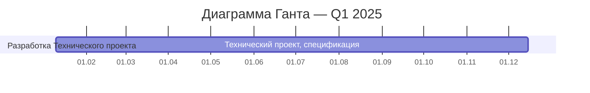
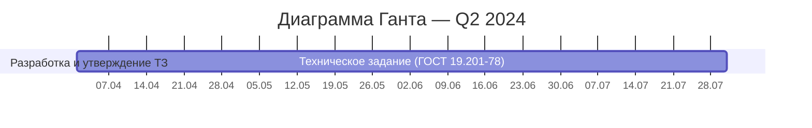
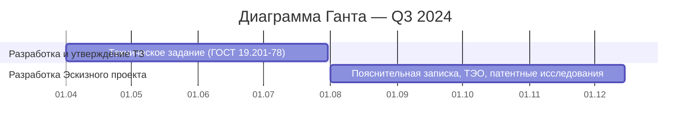
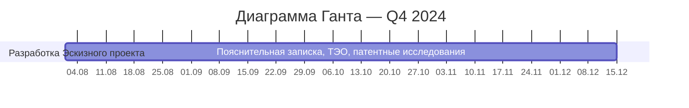

# 📆 Диаграммы Ганта по кварталам (2024–2026)

## 📅 Диаграмма Ганта — Q1 2025

## 📅 Диаграмма Ганта — Q1 2026

## 📅 Диаграмма Ганта — Q2 2024

## 📅 Диаграмма Ганта — Q2 2025

## 📅 Диаграмма Ганта — Q2 2026

## 📅 Диаграмма Ганта — Q3 2024

## 📅 Диаграмма Ганта — Q3 2025

## 📅 Диаграмма Ганта — Q3 2026

## 📅 Диаграмма Ганта — Q4 2024

## 📅 Диаграмма Ганта — Q4 2025

